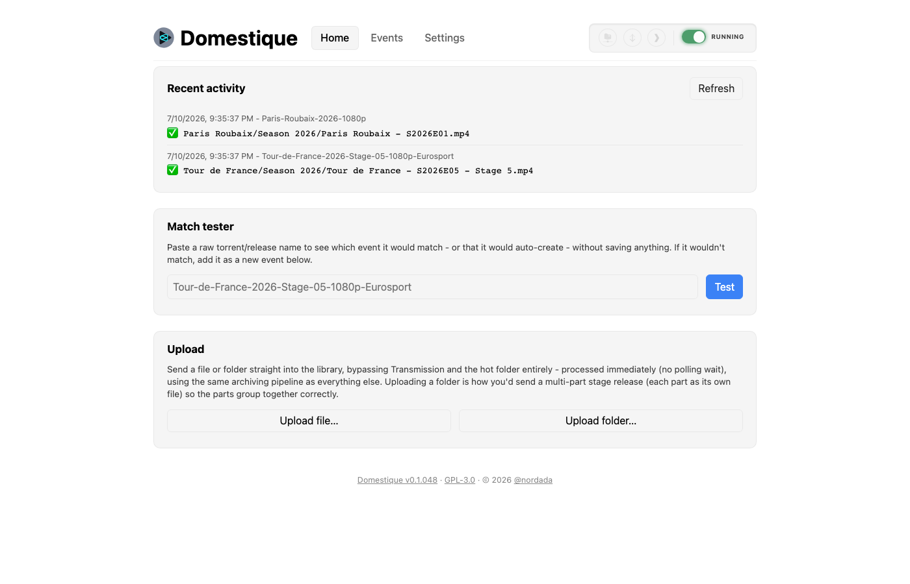
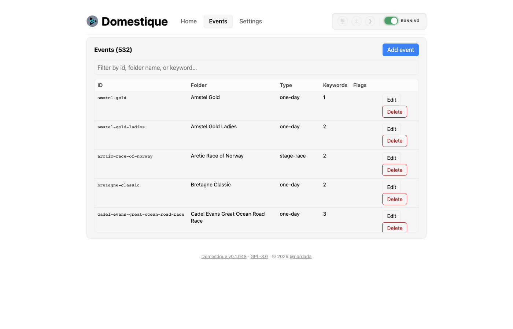
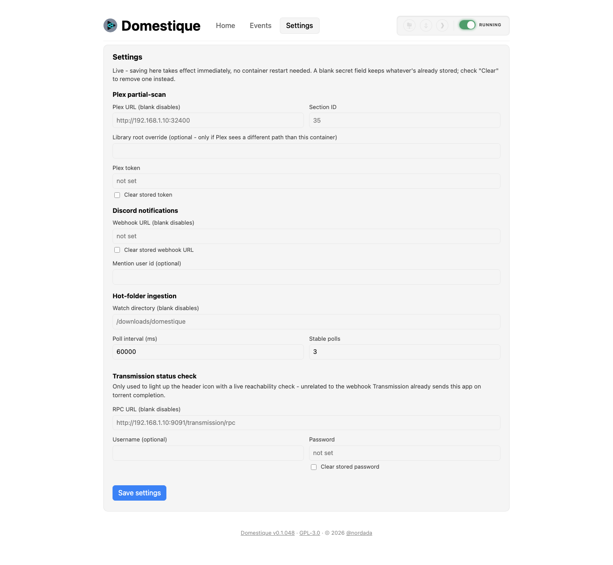

# Domestique

Domestique watches a downloads folder for finished bike-race torrents and
automatically files them into a clean, Plex-ready library - renamed out of
whatever cryptic name the tracker gave them and into a consistent
`Show Name - SYYYYEnn - Title - ptNN.ext` scheme, sorted into the right
show and season folder.

**What it does:**

- Picks up completed downloads via a Transmission webhook, a watched hot
  folder, or a direct upload through its own web UI
- Parses the release name for year, stage/part number, category, and
  broadcaster
- Matches it against a configurable list of races/shows - auto-creating a
  best-guess entry if nothing matches, so nothing silently falls on the
  floor
- Copies (never moves or deletes) the file into place, so Transmission's
  seeding is never affected
- Recognizes duplicate, upgraded-resolution, and alternate-broadcaster
  releases of the same race, filing them alongside the original instead of
  overwriting or guessing wrong
- Optionally tells Plex to rescan just the folder that changed, and posts a
  summary of what happened to Discord

Runs anywhere Docker does - Unraid, Synology, a bare Linux box, or macOS
(via Docker Desktop or [Colima](https://github.com/abiosoft/colima)) - the
setup below is written generically, with Unraid called out only where its
UI gives you a shortcut a plain Docker host doesn't.

## Screenshots

The web UI (see [step 7](#7-optional-web-ui)) - a home tab with recent
activity, a match tester, and manual upload:



An events tab for adding/editing which races and shows it recognizes,
without hand-editing JSON:



And a settings tab for Plex, Discord, hot-folder, and Transmission
status-check configuration - editable live, no restart needed:



## Requirements

- Docker with the Compose v2 plugin (`docker compose`, not the older
  hyphenated `docker-compose` binary).
- Transmission (or another downloader) that can call a webhook via
  `script-torrent-done` - or skip that entirely and use [hot-folder
  ingestion](#5-optional-hot-folder-ingestion-bypass-transmission) instead.
- Node.js 20+ - only needed if you're running tests or `npm run dev`
  outside Docker; the container image builds and runs everything itself.
- Optional: a Plex server, if you want [partial-scan
  integration](#4-optional-plex-partial-scan).

## Contents

- [Screenshots](#screenshots)
- [How it works](#how-it-works)
- [Handling re-releases of the same race](#handling-re-releases-of-the-same-race)
- [Alternate versions (different commentary/broadcaster)](#alternate-versions-different-commentarybroadcaster)
- [Filename convention](#filename-convention-new-downloads-only--existing-seasons-are-untouched)
- [Setup](#setup)
  1. [Configure the archiver itself](#1-configure-the-archiver-itself)
  2. [Configure Transmission's hook script](#2-configure-transmissions-hook-script)
  3. [Add a new show](#3-add-a-new-show)
  4. [Optional: Plex partial-scan](#4-optional-plex-partial-scan)
  5. [Optional: hot-folder ingestion](#5-optional-hot-folder-ingestion-bypass-transmission)
  6. [Optional: Discord notifications](#6-optional-discord-notifications)
  7. [Optional: web UI](#7-optional-web-ui)
- [Known limitations / assumptions](#known-limitations--assumptions-check-these-against-reality-as-you-go)
- [Testing](#testing)
- [Development](#development)
- [License](#license)
- [Why "Domestique"?](#why-domestique)

## How it works

1. Transmission finishes a download and runs `scripts/torrent-done.sh`
   (installed wherever Transmission itself runs), which POSTs the torrent's
   dir/name/id/hash as JSON to this app's `/webhook/torrent-done` endpoint.
2. The app parses the raw name (`src/parser.ts`) to pull out year, stage
   number, part number, gender/age/discipline category hints, and
   highlights/presentation flags.
3. It matches those tokens against `config/events.json` (`src/matcher.ts`) to
   find the right show. If nothing matches, it **auto-creates** a best-effort
   entry (title-cased from the leftover tokens, filed as a one-day race) and
   persists it back to `config/events.json` so it's reused next time - but
   this is a guess; check the log and clean up the entry by hand.
4. It computes the destination folder/filename (`src/namer.ts`) and copies
   the file in (`src/fileops.ts`), writing to a `.tmp` sibling and renaming
   into place so Plex never sees a half-copied file.

## Handling re-releases of the same race

Private trackers often ship the same event more than once - a low-quality
grab that beats the RSS feed, followed by a proper release, or just a
different group's version. Since destination filenames don't encode
resolution (they stay clean, matching your existing convention), each
season folder gets a hidden `.archiver-meta.json` sidecar (invisible to
Plex) that remembers what resolution was archived per episode, parsed from
the *source* torrent name (e.g. `720p`, `1080p`) - not measured from the
actual video.

When a new file arrives for an episode that's already archived:
- **Lower resolution** than what's already archived → skipped, logged as a
  warning.
- **Higher resolution** → filed *alongside* the existing file(s) with a
  `- REVIEW - possible 1080p upgrade` tag inserted into the filename (before
  any part suffix), plus a logged warning. **Nothing is ever auto-deleted**
  - you decide whether to keep the upgrade and manually remove the old
  lower-res file(s). The sidecar keeps remembering the *original* resolution
  (not the reviewed one) until you clean up, so repeated arrivals keep
  getting flagged rather than silently drifting.
- **Same (or unknown) resolution on both sides** → see "Alternate versions"
  below - this is where broadcaster/commentary is used to tell a genuine
  re-release apart from just the next part of the same release still
  trickling in.

This only works when the source name actually carries a resolution tag -
if it doesn't, comparison is skipped and the file is copied without any
quality judgment (see Known limitations below).

## Alternate versions (different commentary/broadcaster)

Sometimes the same race gets released more than once at the *same*
resolution, just from a different broadcaster or with different commentary
(Eurosport vs SBS vs RCS, etc - `src/parser.ts` recognizes a curated list of
these and extend it there as new ones show up). Rather than treating that
as either a duplicate (and skipping it) or blindly overwriting, it's filed
as a selectable alternate version:

- The **first** broadcaster seen for an episode is the "primary" and always
  gets the clean, untagged filename, same as before this feature existed.
- A **different** broadcaster arriving for the same episode at the same
  resolution is filed *alongside* it with the broadcaster's name inserted
  into the filename before any part suffix, e.g.:
  `Tour de France - S2026E01 - Stage 1 - Eurosport - pt01.mp4`
  next to the primary `Tour de France - S2026E01 - Stage 1 - pt01.mp4`.
  All of that alternate's own parts (`pt02`, `pt03`, ...) keep the same tag
  consistently, so a multi-part alternate version stays grouped together
  under its own numbering.
- Since both filenames still contain the same `S2026E01` episode marker,
  Plex should recognize them as alternate versions of the same episode and
  let you pick which to play, the same way it handles multiple versions of
  a movie.
- A **matching** broadcaster (or unknown broadcaster on either side) is
  treated as a normal continuation of the same release - e.g. the next part
  of a multi-part download still arriving - and copied under the clean
  filename, exactly as before.

This is tracked in the same `.archiver-meta.json` sidecar as resolution, so
it only kicks in for releases the source name actually identifies a
broadcaster for.

## Filename convention (new downloads only - existing seasons are untouched)

- Stage race: `Show - SYYYYEnn - Stage n.ext` (or `- pt01.ext` per part).
  `E00` is reserved for Team/Route Presentation specials.
- One-day race: `Show - SYYYYE01.ext` (no title segment - the show + season
  already say what it is).
- Multi-category, fixed order (Worlds, Olympics): `Show - SYYYYEnn - Category
  Title.ext`, where the episode number for each category is defined in
  `config/events.json` so it's stable across years.
- Multi-category, dynamic order (Nationals - the category set is open-ended
  across countries): `Show - SYYYYEnn - Country Gender Discipline.ext`,
  episode number assigned by scanning what's already in that season's folder
  (reuses the number if that exact title is already there, otherwise
  next-available).
- Highlights: filed under a separate show folder (e.g. `Tour de France
  HIGHLIGHTS`), but the *filename* keeps the base show's name, e.g. `Tour de
  France - S2026E01 - Stage 1 Highlights.mp4` - matches what's already in
  the library.

## Setup

**On Unraid**, the easiest path is Community Applications rather than the
manual steps below: add `https://github.com/nordada/domestique` as a
template repository (Apps tab → gear icon → Template repositories), then
install "domestique" from Apps like any other CA container. It pulls the
prebuilt image from GHCR (`ghcr.io/nordada/domestique`, published by this
repo's GitHub Actions workflow) instead of building from source, and its
config fields map directly to the steps below - the descriptions in the
Unraid UI point back to the relevant sections here for anything that needs
more explanation than fits in a form field. The rest of this section is for
everyone else (or if you'd rather build from source yourself).

All host-specific values (paths, IPs, port) live in two `.env` files, never
committed to git - copy the `.example` versions and fill them in.

### 1. Configure the archiver itself

```
cp .env.example .env
```

Edit `.env` and set `LIBRARY_ROOT`, `DOWNLOADS_DIR`, and `PORT` to match your
setup. `DOWNLOADS_DIR` must be the host path to the **same share**
Transmission's own container maps to `/downloads` internally - find that
path from Transmission's own volume mapping:
- **Unraid**: Docker tab → the Transmission container → its path mappings.
- **Plain Docker**: check your own compose file/run command for
  Transmission, or run `docker inspect <transmission-container> --format
  '{{json .Mounts}}'`.
- **Running everything on one macOS/Linux box for local testing**: just
  point `LIBRARY_ROOT`/`DOWNLOADS_DIR` at ordinary local folders, e.g.
  `~/Movies/bike-racing` and `~/Downloads`.

(`.env.example`'s defaults are just illustrative Unraid `/mnt/user/...`
paths - swap in your own paths regardless of platform.) Then:

```
docker compose up -d --build
```

`docker-compose.yml` reads `.env` automatically - nothing else to edit there.
Verify it's up: `curl http://localhost:8420/health` should return
`{"status":"ok"}`.

### 2. Configure Transmission's hook script

In Transmission's `settings.json`:

```json
"script-torrent-done-enabled": true,
"script-torrent-done-filename": "/path/to/torrent-done.sh"
```

Copy `scripts/torrent-done.sh` **and** `scripts/torrent-done.env.example`
to wherever Transmission can read them (inside its own container if that's
where it runs), then:

```
cp torrent-done.env.example torrent-done.env
chmod +x torrent-done.sh
```

Edit `torrent-done.env` and set `ARCHIVER_URL` - since Transmission and
Domestique are separate containers not on the same Docker network, this
needs to be your Docker host's LAN IP (not a container name), e.g.
`http://192.168.1.10:8420/webhook/torrent-done` (that's a stand-in - use
whatever IP your host actually has, e.g. TOWER's if you're on Unraid),
using the same `PORT` you set in Domestique's `.env`.

**Path consistency matters**: the `dir` Transmission reports (`TR_TORRENT_DIR`)
has to resolve to the same file both inside Transmission's container and
inside this one. This project mounts `DOWNLOADS_DIR` at the fixed container
path `/downloads` specifically to match Transmission's own convention - if
your Transmission container maps its share to something other than
`/downloads` internally, change the mount in `docker-compose.yml` to match
it instead. Get this wrong and the hook will fire successfully but the
archiver will fail to find the file (a `ENOENT`-style error in its logs).

### 3. Add a new show

Every show your tracker feed covers needs an entry in `config/events.json`.
The file is bind-mounted, so edits take effect on the next webhook call - no
rebuild needed. Minimal example:

```json
{
  "id": "my-new-race",
  "folderName": "My New Race",
  "matchKeywords": ["my new race", "mnr"],
  "type": "one-day"
}
```

- `type` is one of `stage-race`, `one-day`, `multi-category-fixed`,
  `multi-category-dynamic` - see the Filename convention section above.
- `matchKeywords` entries are space-separated phrases; a show matches if
  *every* token in one of its phrases is present in the parsed name. List
  multiple phrases (e.g. both `"tour de france"` and `"tdf"`) to catch
  abbreviations. More specific phrases (more tokens) win over vaguer ones
  when several shows could match.
- For `multi-category-fixed`, add a `categories` array - see `Nationals` vs
  `World Championships` in `config/events.json` for a worked dynamic vs.
  fixed example.
- `filenamePrefix` is optional and only needed when the filename should say
  something different from the folder name (this is how the HIGHLIGHTS
  shows keep the base show's name in the file itself).

### 4. Optional: Plex partial-scan

**Everything in this section and the next two (hot-folder, Discord) is also
editable live afterward via the web UI's Settings panel** (see step 7) -
no container restart needed. The env vars below are a **one-time seed
only**: the first time `config/settings.json` doesn't exist yet, it's
created from whatever's set in `.env`; after that the file is authoritative
and these env vars are ignored on every later boot. Delete
`config/settings.json` if you want `.env` to reseed it fresh.

**Before your very first `docker compose up` here**, run `touch
config/settings.json` (unlike `config/events.json`, this file isn't shipped
in the repo). Skipping this is harmless on most setups, but if nothing
exists at that path on the host yet, Docker creates an empty *directory*
there instead of a file - a well-known bind-mount gotcha the app can't clean
up on its own, since by then it's the container's actual mount point. If
you hit this (crash-looping with an `EBUSY`-related error mentioning
`settings.json`), stop the container, `rmdir config/settings.json` on the
host, `touch` an empty file in its place, then start it again.

By default Plex only notices new files on its own scan schedule. Set these
in `.env` to have the archiver tell Plex to rescan just the one season
folder that changed, right after each successful copy - not the whole
racing library, and not any of your other Plex libraries:

```
PLEX_URL=http://192.168.1.10:32400
PLEX_TOKEN=<your token>
PLEX_SECTION_ID=<the racing library's section id>
```

**Finding your Plex token**: sign into the Plex web app, open any item's
"..." menu → "Get Info" → "View XML" - the URL that opens contains
`X-Plex-Token=...` in its query string; copy that value. (Plex's own
support site documents a couple of other ways to find this too, if that
one doesn't work for your Plex version.)

**Finding your section id**, once you have the token:
```
curl "http://192.168.1.10:32400/library/sections?X-Plex-Token=<your token>"
```
This returns XML listing every library; find the racing one and use its
`key` attribute as `PLEX_SECTION_ID`.

**If Plex runs in its own Docker container**, it may mount the same host
share at a different internal path than this container does - the exact
same category of issue as Transmission's `/downloads` mapping earlier in
this README. If so, also set `PLEX_LIBRARY_ROOT` in `.env` to the library
root as Plex's own container sees it (on Unraid, check Plex's path mappings
in the Docker tab; on plain Docker, check Plex's own compose file/run
command). Leave it unset if Plex sees the identical path - e.g. if Plex
runs directly on the same host filesystem, not in its own container.

Leaving `PLEX_URL`/`PLEX_TOKEN`/`PLEX_SECTION_ID` unset disables this
entirely - nothing else about the archiver changes, and startup logs will
say `plex refresh: disabled`. A failed Plex refresh is only ever logged as
a warning; it never affects whether a file gets archived.

### 5. Optional: hot-folder ingestion (bypass Transmission)

For files that didn't come through Transmission at all (a manual download,
something copied over from elsewhere) - drop the file or folder directly
into a watched directory and it goes through the exact same
parse/match/rename/copy/Plex-refresh pipeline as a completed torrent, no
webhook involved. Once a drop's size and modified-time have stopped
changing for a few consecutive checks (so a still-copying file is never
touched mid-transfer), it's processed and the **original is moved** - never
deleted - into that folder's own `processed/` subfolder.

Set in `.env`:
```
HOTFOLDER_DIR=/downloads/domestique
```

This is a subfolder of `DOWNLOADS_DIR`, sibling to Transmission's own
`complete` folder on the host (e.g.
`/mnt/user/downloads/domestique`) - created automatically on
first use if it doesn't already exist. Leave `HOTFOLDER_DIR` unset to
disable the feature entirely; startup logs will say `hot folder: disabled`.

Two more optional tuning knobs, shown here at their defaults:
```
HOTFOLDER_POLL_INTERVAL_MS=60000
HOTFOLDER_STABLE_POLLS=3
```
A drop is considered done once its size/mtime haven't changed across
`HOTFOLDER_STABLE_POLLS` consecutive polls, `HOTFOLDER_POLL_INTERVAL_MS`
apart - the defaults wait roughly three quiet minutes, which is intended to
be safe for large or slow manual copies. If something goes wrong while
processing a drop (e.g. an unexpected error, as opposed to a normal
"skipped: already archived" outcome), it's left in place and logged loudly
rather than moved - the same idempotency that makes the Transmission
webhook safe to fire twice means it's safe to just retry it on the next
poll.

**Why this needs its own volume mount**: `DOWNLOADS_DIR` is bind-mounted
read-only (`docker-compose.yml`) since the app should only ever *copy* from
Transmission's share, never touch it. The hot folder needs to *move* files
(into its `processed/` subfolder), so `docker-compose.yml` layers a second,
more specific read-write mount for just `${DOWNLOADS_DIR}/domestique` on
top of the read-only one - the rest of the Transmission share stays
untouched and read-only. Don't merge these two mounts back into one; that
would make the whole downloads share writable.

### 6. Optional: Discord notifications

Set in `.env` to have the archiver post a message to a Discord channel after
every torrent-done event (from the Transmission webhook or hot-folder
ingestion alike):

```
DISCORD_WEBHOOK_URL=<your webhook URL>
```

**Creating a webhook**: in Discord, go to the target channel's Settings →
Integrations → Webhooks → New Webhook, then "Copy Webhook URL". Treat this
URL like a secret - anyone with it can post to that channel.

Each message summarizes the whole torrent-done event: what got archived,
what was skipped and why, and any auto-created shows, quality/upgrade
warnings, alternate-version tags, or errors. Everything is posted - routine
successful archives as well as warnings - but only the review-worthy items
(auto-created shows, warnings, Plex refresh failures, processing errors)
trigger a mention, if you've set one:

```
DISCORD_MENTION_USER_ID=<your Discord user id>
```

**Finding your user id**: enable Developer Mode (User Settings → Advanced),
then right-click your own name anywhere in Discord and choose "Copy User
ID". Leave `DISCORD_MENTION_USER_ID` unset to have every notification post
without a mention.

Leaving `DISCORD_WEBHOOK_URL` unset disables this entirely - nothing else
about the archiver changes, and startup logs will say `discord: disabled`.
A failed Discord post is only ever logged as a warning; it never affects
whether a file gets archived.

### 7. Optional: web UI

A small web UI at `/ui` for editing `config/events.json` without hand-editing
JSON, testing the matcher against a sample release name, and viewing recent
activity and integration status. Set in `.env`:

```
WEBUI_PASSWORD=<a password you choose>
```

Then browse to `http://<TOWER-IP>:8420/ui` - your browser will prompt for
credentials (HTTP Basic Auth). By default any username is accepted and only
the password is checked. Optionally also set

```
WEBUI_USER=<a username you choose>
```

to require that exact username too, checked alongside the password.

**This one fails closed, not open**: unlike Plex/hot-folder/Discord above,
where leaving the env var unset just disables the feature, leaving
`WEBUI_PASSWORD` unset makes `/ui` and its `/api/*` routes respond `503`
rather than being reachable without a password - this surface can read and
overwrite your config, so "unconfigured" must not mean "open to anyone on
the LAN."

What's in it:
- **Match tester** - paste a raw release name and see which event it
  matches (or that it would auto-create, and as what) using the app's real
  parser/matcher, without touching `config/events.json` or the library. Handy
  for checking a `matchKeywords` change before a real download exercises it.
  If nothing matches, an "Add as new event" button pre-fills the form below
  with the guessed name/type.
- **Events table** - add/edit/delete entries, including the `categories`
  editor for `multi-category-fixed` events (Nationals/Worlds-style). Saves
  write the whole file back through the same `saveConfig` validation
  (duplicate ids, required fields, etc.) the app already uses, so an invalid
  save is rejected with the same error message you'd get from a bad
  hand-edit - nothing is written to disk unless it's valid. (Internally this
  is still the `ShowConfig`/`ShowsConfigFile` shape in `src/config.ts` - only
  the file name, API route, and UI wording say "events".)
- **Upload** - send a file or folder straight into the library from the
  browser, bypassing Transmission and the hot folder entirely. Unlike a real
  hot-folder drop, an HTTP upload has a known length and is unambiguously
  "done" the moment it finishes, so this never waits out the hot-folder's
  stability-poll interval - it's staged and processed immediately through
  the exact same pipeline the webhook uses. The staged copy is deleted right
  after successful processing (the real original still lives on your own
  machine); a failed upload is left in place so you can investigate or retry
  without re-uploading. Uploading a folder (multiple files at once) is how
  you'd hand it a multi-part stage release - the parts group together
  (`pt01`/`pt02`/etc) exactly like a real folder-based drop. Staged uploads
  live in a hidden `.uploads-tmp` folder under `LIBRARY_ROOT` (not the
  container's own `/tmp`) since it's already read-write and already sized
  for large video files - no new volume mount needed.
- **Activity log** - the last ~100 torrent-done events (in-memory only,
  resets on container restart), the same summary shown in Discord
  notifications if you have those enabled.
- **Status panel** - at-a-glance whether Plex refresh, hot-folder ingestion,
  and Discord notifications are currently configured, plus the running
  version.
- **Settings panel** - edit the Plex, Discord, and hot-folder settings from
  steps 4-6 above live, no restart needed (backed by `config/settings.json`,
  bind-mounted and gitignored the same way `config/events.json` is, minus the
  git tracking, since this one holds live secrets once set). Secret fields
  (Plex token, Discord webhook URL) are never echoed back once saved - the
  form shows whether one is set, not its value; leave a secret field blank to
  keep what's already stored, or check its "Clear" box to remove it.

`public/index.html` is bind-mounted the same way `config/events.json` is, so
tweaking it doesn't require a rebuild.

## Known limitations / assumptions (check these against reality as you go)

- **UCI XCC/XCO World Cup** isn't in `config/events.json` yet - it wasn't in
  the Plex library at design time, and it has a per-round venue (e.g. "La
  Thuile") baked into the name that a fixed-category show can't cleanly
  express. First download will auto-create a folder per venue; you'll
  probably want to hand-write a proper config entry (possibly
  `stage-race`-shaped, with "round" standing in for "stage") once you see a
  few real names.
- Auto-created show names are naive title-case - acronyms like "UCI" come
  out as "Uci". Expect to rename auto-created folders/entries by hand.
- Missing year in a source name (e.g. `TDF-Stage01-SBS.mp4`, which has no
  year at all) defaults to the current calendar year - logged as a warning.
  Fine for same-season downloads; wrong if you ever batch-import an old
  archive with this tool.
- `TdF Euro Hghlights` vs `Tour de France HIGHLIGHTS`: the config guesses
  that "Eurosport"-branded highlight releases go to the former and
  everything else to the latter. Verify this matches how your tracker
  actually labels releases; adjust `tdf-euro-highlights`'s `matchKeywords`
  in `config/events.json` if not.
- Nationals dynamic episode numbering scans the destination folder's
  existing filenames to avoid collisions/reuse the right number - if you
  manually rename files in a Nationals season folder, keep the `- Country
  Gender Discipline.ext` shape intact or the scanner won't recognize them.
- Resolution-based upgrade detection (see above) only fires when the source
  torrent name actually contains a resolution tag. A release with no
  resolution in its name is filed with no quality comparison at all, so a
  worse re-release could still slip in alongside a better one undetected if
  neither name states its resolution. It also trusts the tracker's stated
  resolution rather than probing the actual video file.
- If you manually delete an old lower-resolution file after reviewing an
  upgrade, the `.archiver-meta.json` sidecar still remembers the old
  resolution until you edit or delete that entry - harmless (worst case is
  an unnecessary future review flag), but worth knowing if the flagging
  seems to "stick" after cleanup.
- Broadcaster detection (`src/parser.ts`'s `BROADCASTER_TOKENS`) is a fixed,
  curated list - an unrecognized broadcaster is treated as "unknown," which
  means a same-resolution re-release from a broadcaster not in that list
  won't get tagged as an alternate; it'll just fall through to the normal
  continuation/duplicate-skip path. Add new ones to that list as they show
  up in your tracker's releases.
- Nationals-style (`multi-category-dynamic`) shows have a narrow edge case
  when combined with alternate versions: the dynamic episode-numbering scan
  matches titles by exact filename text, so a tagged alternate filename
  (e.g. "... - Eurosport") won't match the plain title text of the primary
  version if you later reprocess that same category from scratch. In
  practice this only matters if the *same* country/category/year gets two
  different broadcaster releases for a Nationals-type show - narrow enough
  that it's left as a known gap rather than adding more regex complexity.

## Testing

```
npm install
npm test
```

`test/fixtures.ts` holds real torrent/download names gathered from this
library while designing the tool; `parser.test.ts`, `matcher.test.ts`, and
`namer.test.ts` exercise the pipeline against them, including the exact
Tour de France / World Championships / Nationals destination examples this
tool was built to reproduce. `fileops.test.ts` covers the resolution-aware
copy/skip/review-upgrade behavior and the broadcaster-based alternate-version
logic (including multi-part alternates) against real scratch directories (no
mocking of the filesystem).

For an end-to-end check without touching real data: `docker compose up
--build`, then `curl` the webhook directly:

```
curl -X POST http://localhost:8420/webhook/torrent-done \
  -H "Content-Type: application/json" \
  -d '{"dir":"/path/to/scratch/downloads","name":"Tour-de-France-2026-Stage-01"}'
```

## Development

`package.json`'s version bumps automatically on every commit (`0.1.001`,
`0.1.002`, ...) via a pre-commit hook at `.githooks/pre-commit`, shown in the
web UI's footer. It's baked into `package.json` rather than computed from git
history at runtime because the deployed copy on TOWER excludes `.git`
entirely. A fresh clone needs to opt into it once:

```
git config core.hooksPath .githooks
```

## License

GPL-3.0 - see [LICENSE](LICENSE).

## Why "Domestique"?

In cycling, a domestique is the rider whose entire job is unglamorous
support work for the team - fetching bottles, setting pace, spending
themselves so a teammate can win in the spotlight. That's the idea behind
the name: this tool doesn't do anything glamorous either, it just quietly
files things away correctly so the footage gets to be the star.
