# Domestique

Domestique is a boutique PVR for bike racing: the same idea as a DVR, or
tools like Sonarr/Radarr if you know those, but built specifically for how
race footage actually gets released, with multi-part stages, the same race
re-released by different broadcasters, and trackers that name every file
slightly differently. It watches a downloads folder for finished race
torrents and automatically files them into a clean, Plex-ready library,
renamed out of whatever name the tracker gave them and into a consistent
`Show Name - SYYYYEnn - Title - ptNN.ext` scheme, sorted into the right
show and season folder, so your library looks the same whether a file came
from this year's Tour de France or a Nationals road race from a country you
didn't know held one.

**What it does:**

- Picks up completed downloads via a Transmission webhook, a watched hot
  folder, or a direct upload through its own web UI
- Parses the release name for year, stage/part number, category, and
  broadcaster
- Matches it against a configurable list of races/shows - auto-creating a
  best-guess entry if nothing matches, so nothing silently falls on the
  floor
- Files it into place without ever moving or deleting the original - by
  default a real copy (so Transmission's seeding is completely decoupled
  from the library), with an optional hardlink mode that saves the doubled
  disk space instead (see "Library filing" in Settings)
- Recognizes duplicate, upgraded-resolution, and alternate-broadcaster
  releases of the same race, filing them alongside the original instead of
  overwriting or guessing wrong
- Optionally tells Plex to rescan just the folder that changed, and posts a
  summary of what happened to Discord
- Also works backwards: the **Torrent Index** tab gives you one unified,
  filterable view of every torrent it knows about (whether staged through
  it or already seeding in Transmission), cross-referenced live against
  your Plex library, with bulk actions to reseed, verify, dedupe, or
  archive clutter without deleting anything

Runs anywhere Docker does - Unraid, Synology, a bare Linux box, or macOS
(via Docker Desktop or [Colima](https://github.com/abiosoft/colima)) - the
setup below is written generically, with Unraid called out only where its
UI gives you a shortcut a plain Docker host doesn't. **If you're building a
server from scratch just to run this** (Domestique plus Plex and
Transmission, on a machine with a stack of drives for storage), Unraid is
the most approachable starting point of that list: it has a graphical
installer for all three, and the Unraid-specific notes throughout this
README exist for exactly that path.

## Web UI tour

Most day-to-day use happens through the web UI, not the command line or a
config file. This section walks through every screen in it, what each
control actually does, and (for anyone who wants to know) exactly what it
touches on your system to do it. It's optional (see [step
8](#8-optional-web-ui) to enable it) but recommended; without it you'd be
hand-editing JSON files instead.

### Header: status at a glance

The header sits at the top of every tab.

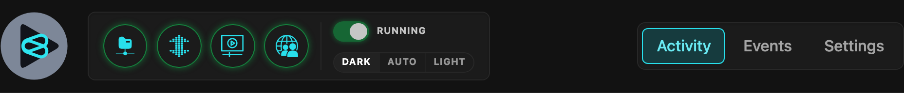


Four circular icons, left to right, each dim/gray when that integration
isn't configured at all:

- **Hot folder:** lit whenever the downloads share itself is reachable
  (regardless of whether hot-folder ingestion is turned on); the ring glows
  green once hot-folder ingestion is enabled *and* you've acknowledged its
  one tradeoff in Settings (see below), red if you've enabled it but not
  yet acknowledged that.
- **Transmission:** green when Transmission's RPC is reachable and every
  torrent is idle/seeding with no errors, amber while something's actively
  downloading, red if any torrent has a tracker or local error. Click it to
  open Transmission's own web UI in a new tab.
- **Plex:** green when Plex responds to a lightweight identity check. Click
  it to jump straight to the configured library section in Plex Web.
- **External indexer:** bookmarks whatever race indexer/tracker site you
  source torrents from; shows that site's own favicon (falling back to a
  generic icon if the site doesn't serve one). Green/red reflects a
  reachability check that runs on its own timer (see Settings below), not
  on every page load, so a slow response from that site doesn't flicker the
  icon.

Clicking a dim/unconfigured icon, or Transmission/Plex before they're
reachable, jumps to the Settings tab instead of a dead link. Next to the
icons: a **pause switch** (stops the Transmission webhook and hot-folder
watcher without touching manual upload or the match tester, handy if
you're about to bulk-reorganize your library by hand and don't want the
automation fighting you), and a **Dark/Auto/Light theme toggle**, both
remembered per-browser across reloads.

### Activity tab

The tab you land on by default, and where you'd actually watch things
happen.

<table>
<tr>
<td>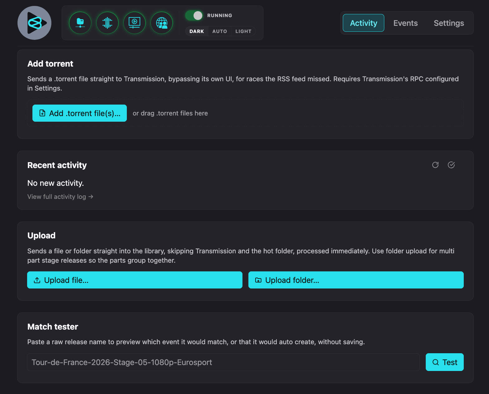<br><sub>Dark (default)</sub></td>
<td>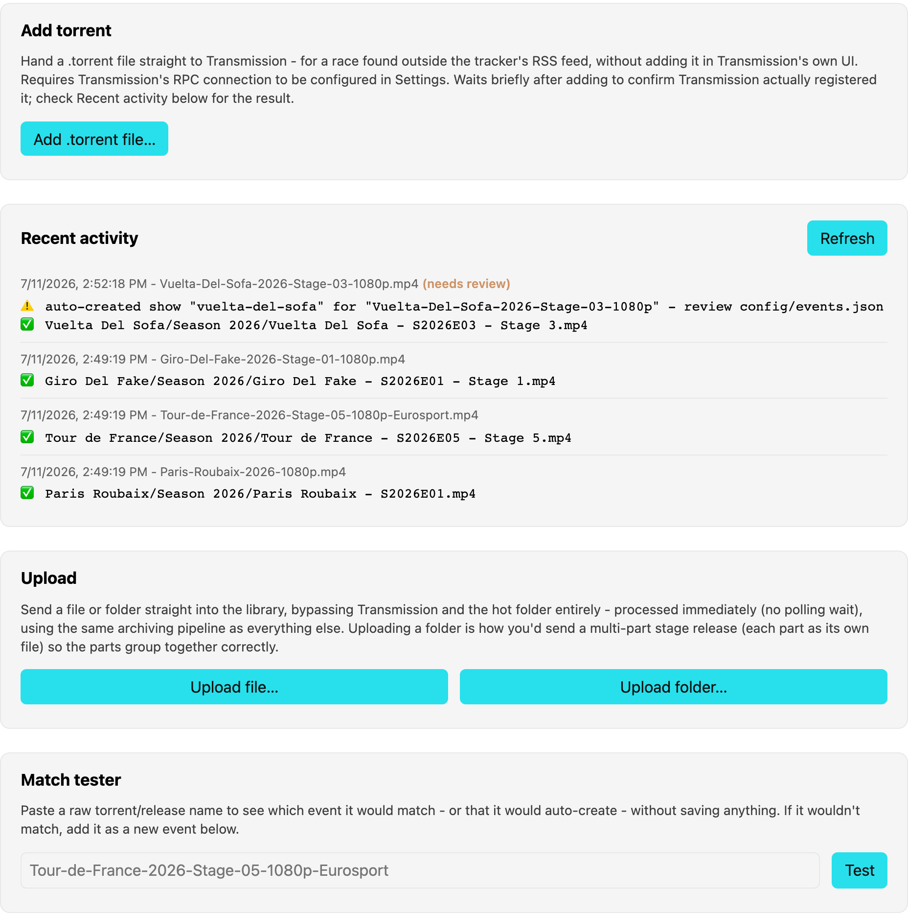<br><sub>Light mode</sub></td>
</tr>
</table>

**Add torrent:** hands a `.torrent` file straight to Transmission via its
RPC API, for a race you found outside your tracker's own RSS feed, without
opening Transmission's own UI at all. Nothing is written to your library by
this step; it only tells Transmission to start downloading. Requires the
Transmission connection under Settings.

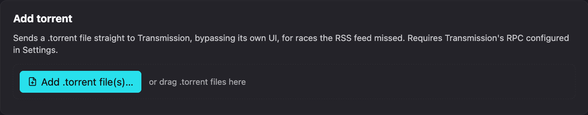

**Recent activity:** the last ~100 completed-download events, whether they
came from the Transmission webhook, the hot folder, or a manual upload.
Persisted to `config/activity.json` (bind-mounted, same as `events.json`/
`settings.json`) so it survives a container restart, not just process
memory; it's a log for your own peace of mind, not a database anything else
depends on. A
✅ line means a file was copied into the library, and a ⚠️ means something
worth a look (an auto-created show, a possible resolution upgrade filed
alongside an existing one, a failed Plex refresh); those get an orange
**(needs review)** tag next to the timestamp, same wording used in Discord
notifications if you have those on.

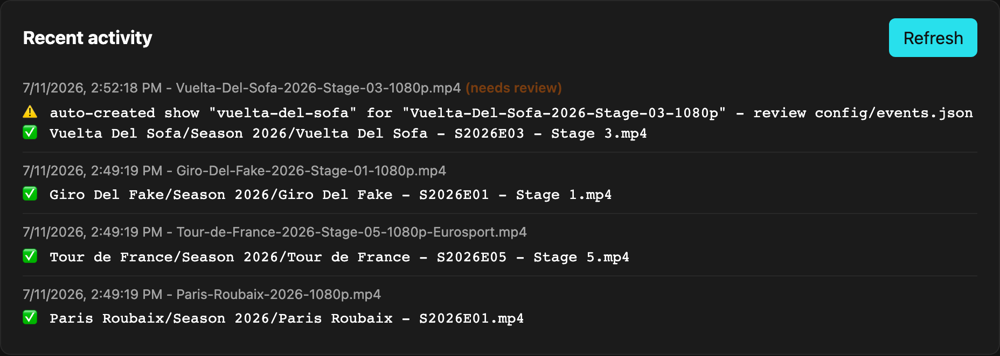

**Upload:** drag a file (or a whole folder, for a multi-part release) from
your own computer straight into the library through the browser, bypassing
Transmission and the hot folder entirely. This is a real HTTP upload: the
file's bytes travel from your browser to wherever Domestique is running,
staged in a temporary folder under the library path, then processed through
the exact same parse/match/rename/copy pipeline as everything else, then
the staged copy is deleted. Your original file on your own machine is never
touched.

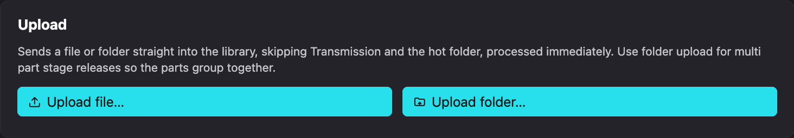

**Match tester:** paste a raw filename and see which show it would match
(or that it would auto-create, and what the guessed name would be), without
touching your config or copying anything; purely a dry run. Useful for
checking a tricky name, or a new `matchKeywords` phrase, before a real
download exercises it for real.

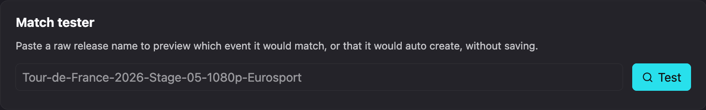

### Events tab

"Events" here means races/shows, every entry your tracker's releases need
to match against to file correctly. This tab edits the same
`config/events.json` file the app itself reads, through the browser instead
of a text editor.

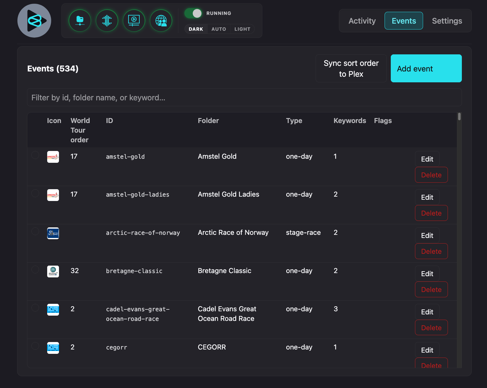

The filter box searches id, folder name, and keywords at once, handy once
you have a few hundred entries, which happens fast if your tracker covers
more than a handful of race series. **Add event** opens the same form used
for editing an existing one:

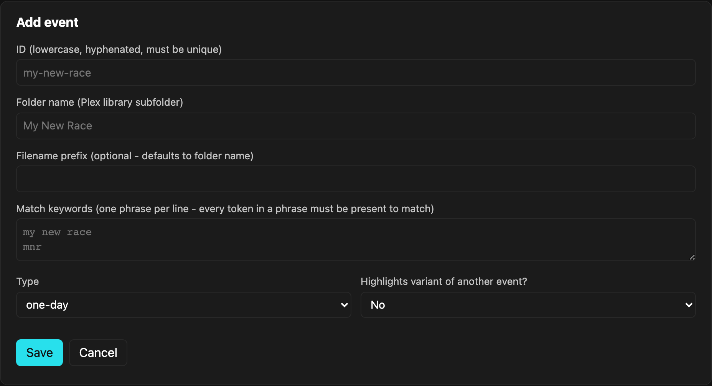

Saves are validated the same way a hand-edit of the JSON file would be
(unique ids, required fields); an invalid save is rejected with an error
instead of corrupting the file. See [Add a new show](#3-add-a-new-show)
below for what each field actually means.

**Cover art**: once a show's been saved (reopen it to see this - it's not
on the initial Add form), a **Logo** section lets you set the image
Domestique composites into that show's generated Plex poster. Three ways
to provide one: **Upload logo** (any image file from your own computer),
**Search Wikipedia** (looks up the race name, falling back to a broader
Wikimedia Commons search if no Wikipedia article has a usable image - see
Settings below for the global defaults this composites onto), or **Add
from URL** (any direct image link). Each show can also **override** the
global background color/gradient/logo-size defaults for just that one
poster, via a checkbox in the same section.

### Torrent Index tab

One unified table of every torrent Domestique has a saved `.torrent` for -
whether it got there by staging a reseed here, or by syncing in
automatically from Transmission's own torrents directory (see [step
6](#6-optional-the-index-tab-reseed-from-your-plex-library-and-a-unified-torrent-view)
below for enabling that and the underlying staging/hardlink mechanics).
Every entry is cross-referenced **live, on every load** against both your
Plex library (matched by exact file size) and Transmission (live seeding
status) - neither is authoritative over the other, so a torrent found in
only one, both, or neither is all real, meaningful state.

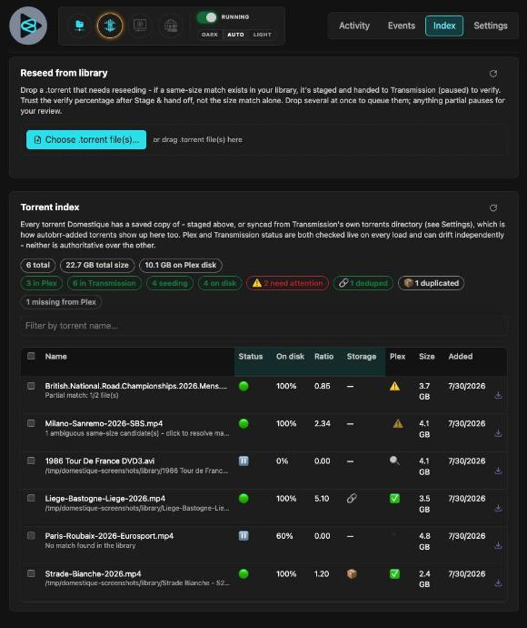

**Stat/filter pills** above the table summarize the whole set at a glance -
total, in Plex, in Transmission, seeding, on disk, ⚠️ need attention,
🔗 deduped, 📦 duplicated, and a deliberately muted **missing from Plex**
pill last (expected/normal at scale on a large library, not worth the same
visual weight as the others). Each is clickable and they AND-combine - click
"in Plex" and "seeding" together to see only torrents that are both: click
"total" to reset. A row only counts toward **needs attention** when there's
something actually actionable right now - a partial or ambiguous Plex
match, a live/on-disk percentage mismatch, an unreclaimed dedupe leftover,
or a flagged-dirty integrity check; a torrent that's simply never been
filed into Plex at all is its own separate, calmer category (**missing from
Plex**), since on a large library that can genuinely be true for hundreds
of entries at once. A "partial match" also only counts as actionable once
the torrent has actually been downloaded (`percentComplete > 0`) - a
same-size coincidence against a torrent that's never touched disk isn't
something you can do anything about yet, so it's excluded from the count
and its "Add to Plex library" button eligibility both, rather than pointing
at an action that would just fail. The search box filters by torrent name;
click any column header to sort.

**Selection is checkbox-based**: check individual rows (or the header
checkbox for every currently-filtered row), and a bulk action bar appears
showing how many of your selection are eligible for each action - clicking
one only ever touches the eligible subset, skipping the rest silently
rather than erroring. The actions:

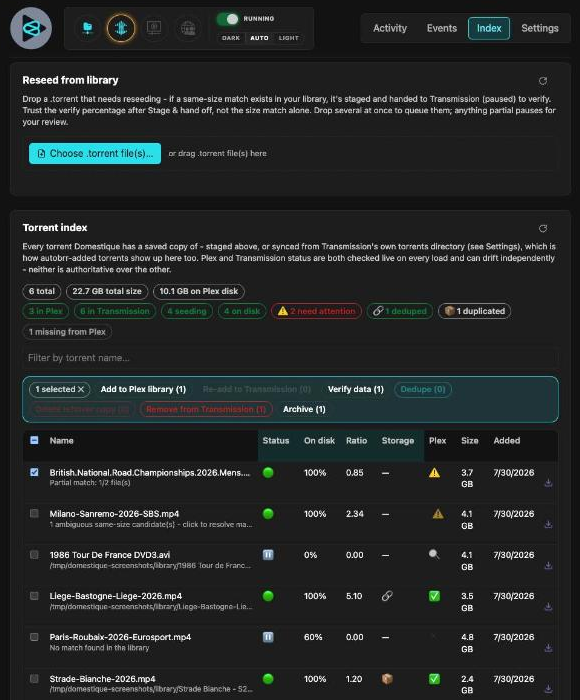


- **Add to Plex library** - runs each eligible torrent through the normal
  parse/match/copy pipeline, for torrents whose data was never filed into
  Plex at all, or whose filed copy is gone. A **Force** checkbox (revealed
  on first click, checked by default, confirm on the second) bypasses the
  "I already have this release" check and files a distinctly-tagged
  (`REVIEW - forced`) copy alongside the existing file instead of skipping -
  it never overwrites anything, but forcing a whole batch forces *every*
  file in each selected torrent, so a torrent that's already partly correct
  can end up with an unwanted duplicate of the part that was already fine;
  worth checking the result and deleting any stray duplicate by hand.
- **Re-add to Transmission** - for torrents Domestique still has registered
  but Transmission no longer reports (removed after seeding, cleaned up).
  Re-adds using the saved `.torrent`, staging whatever's already matched in
  your Plex library first - a fully-filed torrent should come back up
  verified and seeding with nothing re-downloaded.
- **Verify data** - forces Transmission to re-check an already-seeding
  torrent's on-disk data against its real piece hashes, something
  Transmission never does again on its own once a torrent first verifies
  clean. A clean result resumes automatically; anything less is left paused
  for review, logged to Activity as review-worthy, and (if configured)
  posts a Discord mention - never auto-redownloaded. The result persists
  (`config/verify-state.json`) and stays visible on that entry until the
  next check, even after the torrent drops out of Transmission entirely.
- **Dedupe** - for a fully-matched torrent whose data is still a separate
  physical copy from its Plex library file (📦 **Duplicated**): hardlinks
  the library copy into the same staging directory the reseed feature uses,
  repoints Transmission there, and forces a real re-verify. A clean result
  flips the chip to 🔗 **Deduped** and reveals **Delete leftover copy** to
  reclaim the now-orphaned downloads-share original; anything less than
  clean automatically reverts Transmission back to its original location
  and re-verifies there too, so a torrent that was seeding fine before
  Dedupe can never end up broken by it.
- **Delete leftover copy** - the explicit, separate follow-up after a
  successful Dedupe. Permanently deletes the original download-folder copy,
  safe since Transmission now seeds from the hardlinked Plex copy instead;
  never touches anything in your Plex library.
- **Remove from Transmission** - removes the torrent from Transmission
  *and* deletes its downloaded data. Never touches anything already filed
  in your Plex library (a completely separate tree it doesn't know the path
  to). Irreversible - gated behind a confirmation dialog.
- **Archive** - for clutter that isn't worth actually throwing away (e.g. a
  torrent whose own name carries no real identifying text, so a same-size
  byte collision can never resolve past "ambiguous" no matter what you pick).
  Unlike Remove, this is fully reversible: hides the torrent from this list
  and best-effort removes it from Transmission, but explicitly does **not**
  delete its downloaded data, its registered `.torrent`, or anything filed
  in Plex. Every archived torrent is listed in the Settings tab's
  **Archive** panel with an **Unarchive** button that brings it straight
  back - see the Settings tab section below.

A row whose Plex match is still ambiguous after auto-guessing shows a
clickable ⚠️ in the Plex column - opens a **Resolve** dialog listing every
same-size candidate for each ambiguous file (best guess first), so you can
pick the right one by hand instead of renaming/moving files in the library.
The pick is remembered (keyed by the torrent's own info-hash) and applied
on every future preview, stage, dedupe, and Index-tab load of that torrent,
not just this one screen.

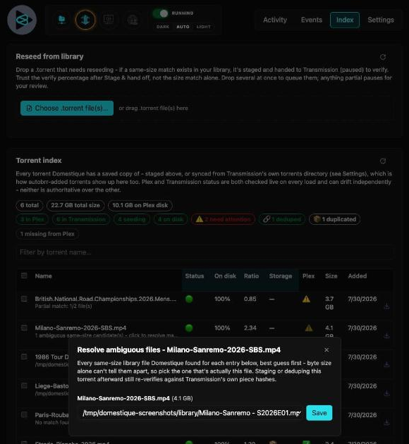

**The percentage shown is deliberately not Transmission's own
`percentDone`** - Transmission only counts files it considers "wanted"
toward that figure, so a torrent with some files deselected can report
100% done while having nothing actually on disk for them. This tab
computes its own figure straight from each file's actual bytes-on-disk
versus its full size instead, labeled "on disk" to be unambiguous; if the
two disagree, both are shown side by side rather than silently picking one.

### Settings tab

Everything here is **live**: saved straight to `config/settings.json` and
picked up immediately, no container restart needed. Each field maps to an
environment variable described later in this README; think of those env
vars as a one-time seed for a fresh install, and this tab as how you'd
actually change any of it afterward.

**Appearance:** override the accent color used by primary buttons and "on"
status icons (any 6-digit hex, previewed live as you type). Purely
cosmetic, stored per-server (not per-browser like the theme toggle).

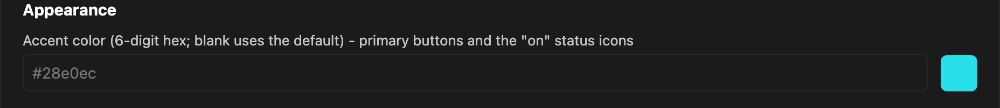

**Cover art:** generates an actual Plex poster (`poster.jpg`) for a show
once it has an uploaded logo (see the Events tab above) - most niche race
series aren't recognized by Plex's own metadata agents, so this is how
they get real artwork instead of a blank placeholder. Purely opt-in per
show: nothing is generated for a show with no logo. Sets the global
background color (plus an optional gradient end color - blank uses a
solid fill) and logo scale every poster uses by default, unless a specific
show overrides them from its own Events-tab entry. **Regenerate all
posters** rebuilds every existing poster from these settings - useful
after changing a color scheme, without re-uploading every logo. These
colors are independent of the Appearance accent color above (that's this
web UI's own theme; this is what shows up inside Plex itself).

**Status polling:** how often the header's status icons refresh in the
background. Lower means more current information, but also more frequent
requests to Transmission/Plex/your indexer site; the default (20s) is a
reasonable middle ground for a home server.

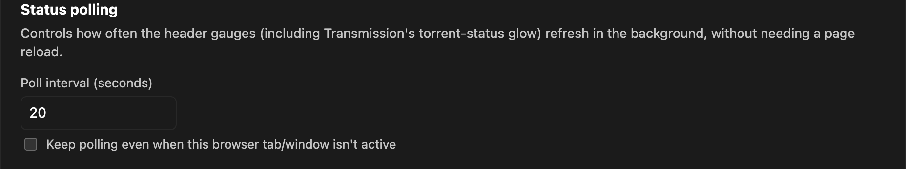

**Plex partial-scan:** tells Plex to rescan just the one folder that
changed, right after a file's copied in, instead of waiting for Plex's own
scan schedule. Nothing here affects whether a file gets filed; a failed
Plex refresh only ever shows up as a ⚠️ warning in Recent activity, never
blocks the copy.

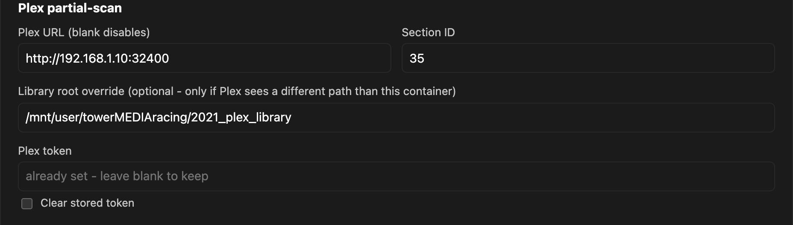

**Discord notifications:** posts a summary to a Discord channel after every
completed-download event, success and warnings alike, with a mention only
on the review-worthy ones if you set a user id. Also used for one other
thing entirely: a mention-tagged alert the moment the login lockout below
actually triggers (see Login lockout).

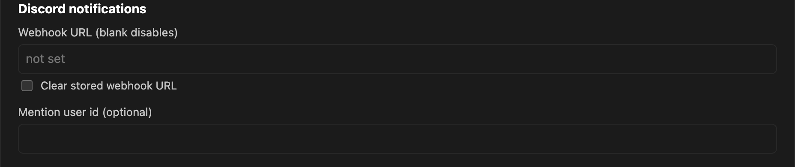

**Hot-folder ingestion:** for files that arrive some way other than
Transmission's webhook (a manual download, something copied over from
another machine), drop it in the watched directory and it goes through the
same pipeline. The one tradeoff worth understanding before turning this on:
unlike the webhook path (which only ever *copies*, so Transmission keeps
seeding untouched), hot-folder ingestion *moves* the original file out of
the downloads share, into a `processed/` subfolder, trading seedback for
automation on anything dropped this way. The checkbox exists specifically
to make sure you've seen that tradeoff before it's live.

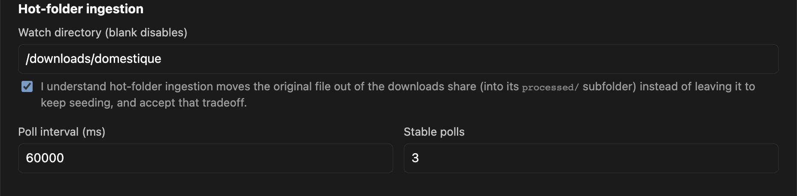

**Transmission status check:** a separate RPC connection purely for the
header gauge's live status (and the Add-torrent feature above), unrelated
to the webhook Transmission itself sends this app on completion. Leaving
this unset doesn't break anything else; the gauge just stays dim. Unlike
Plex/Discord/hot-folder, there's no `.env` equivalent for this one: it's
Settings-only, entered here or not at all.

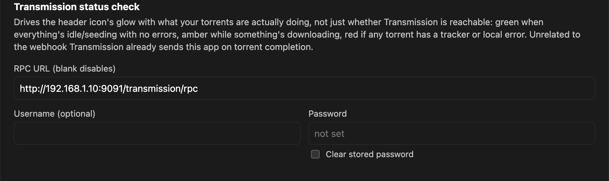

**External indexer:** see the header section above; this is where you set
the URL and how often it's health-checked. Also Settings-only, no `.env`
equivalent.

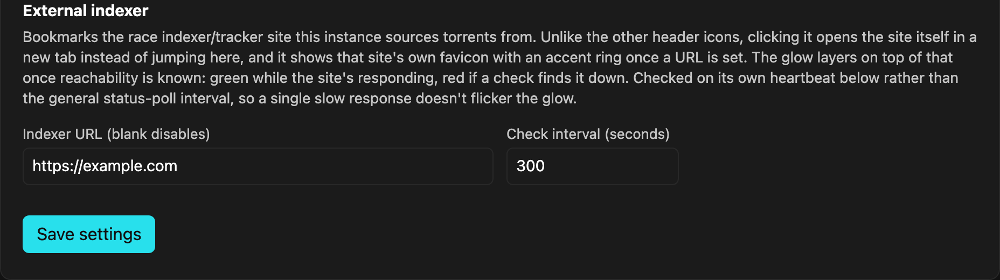

**Reseed from library** (also where **Library filing** lives): two
related settings, both Settings-only with no `.env` equivalent. **File
mode** controls how a *normal* completed download gets filed - the
Transmission webhook, hot-folder, upload, and "Add to Plex library" all go
through this, not just the Reseed tab. "Dual copies" (the default) keeps
the downloads-share and library files genuinely separate, at the cost of
double disk space per torrent - the reason the Torrent Index tab's Dedupe
action exists. "Hardlink" saves that space from the start instead, falling
back to a real copy (logged, not silent) when the downloads share and
library are on different filesystems. Below that, the **staging directory
override** is where the Torrent Index tab's own reseed-from-library
feature stages files before handing them to Transmission - see [step
6](#6-optional-the-index-tab-reseed-from-your-plex-library-and-a-unified-torrent-view)
for the full hardlink-staging mechanics and why the default (a hidden
folder inside your library root) matters.

**Webhook security** and **Login lockout** below live together under one
**Security** subtab in the actual UI - same content as documented here,
just grouped under one heading.

**Webhook security:** `/webhook/torrent-done` (what Transmission's hook
script calls) has no authentication of its own; it's meant to be reached
only by that script, trusted implicitly on a LAN. If you ever expose this
app past your LAN (a reverse proxy, a Cloudflare Tunnel), set a secret
here and the matching `WEBHOOK_SECRET` in `torrent-done.env`, and the
webhook will reject any request missing a correct `X-Webhook-Secret`
header. Leave blank to keep the original open behavior.

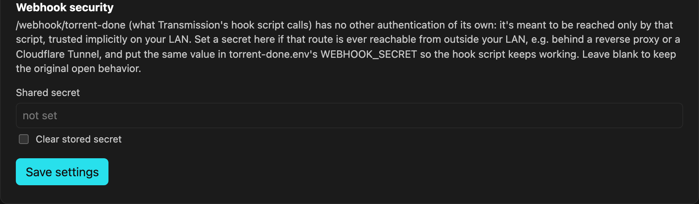

**Login lockout:** HTTP Basic Auth (the password prompt for `/ui`) has no
brute-force protection of its own, so this is the retrofit for that too.
After this many consecutive wrong-password attempts, further attempts are
rejected with a cooldown instead of even being checked. The cooldown
auto-expires (no restart needed), doubling each time it's triggered again
right after the previous one expires, up to a fixed 30-minute cap, and
resetting back to the base once a login actually succeeds. If Discord
notifications above are configured, the moment a lockout triggers also
posts a mention-tagged alert, once per trigger, not on every request
rejected while still locked out.

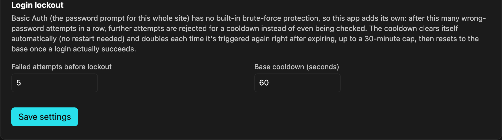

**Archive:** every torrent currently hidden from the Torrent Index tab via
its **Archive** action (see above) - name, size, and when it was archived,
each with an **Unarchive** button that brings it straight back into the
Index. Nothing here was ever deleted; archiving only ever hides an entry
from the main list.

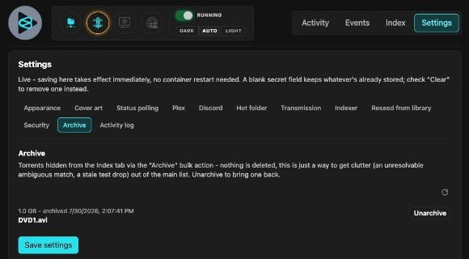

**Activity log:** the complete activity history (up to the last 100
events), including ones already marked as read on the Activity tab -
nothing gets deleted when you clear or mark an entry read there. The same
underlying data as the Activity tab's own list, just the full history
instead of only what's unread.

## Requirements

- Docker with the Compose v2 plugin (`docker compose`, not the older
  hyphenated `docker-compose` binary).
- Transmission (or another downloader) that can call a webhook via
  `script-torrent-done` - or skip that entirely and use [hot-folder
  ingestion](#5-optional-hot-folder-ingestion-bypass-transmission) instead.
- Node.js 20+ - only needed if you're running tests or `npm run dev`
  outside Docker; the container image builds and runs everything itself.
- Optional: a Plex server, if you want [partial-scan
  integration](#4-optional-plex-partial-scan).

## Contents

- [Web UI tour](#web-ui-tour)
- [How it works](#how-it-works)
- [Handling re-releases of the same race](#handling-re-releases-of-the-same-race)
- [Alternate versions (different commentary/broadcaster)](#alternate-versions-different-commentarybroadcaster)
- [Filename convention](#filename-convention-new-downloads-only--existing-seasons-are-untouched)
- [Setup](#setup)
  1. [Configure the archiver itself](#1-configure-the-archiver-itself)
  2. [Configure Transmission's hook script](#2-configure-transmissions-hook-script)
  3. [Add a new show](#3-add-a-new-show)
  4. [Optional: Plex partial-scan](#4-optional-plex-partial-scan)
  5. [Optional: hot-folder ingestion](#5-optional-hot-folder-ingestion-bypass-transmission)
  6. [Optional: the Index tab (reseed from your Plex library, and a unified torrent view)](#6-optional-the-index-tab-reseed-from-your-plex-library-and-a-unified-torrent-view)
  7. [Optional: Discord notifications](#7-optional-discord-notifications)
  8. [Optional: web UI](#8-optional-web-ui)
- [Frequently Asked Questions](#frequently-asked-questions)
- [Known limitations / assumptions](#known-limitations--assumptions-check-these-against-reality-as-you-go)
- [Security posture](#security-posture)
  - [Running as a non-root user](#running-as-a-non-root-user-recommended)
- [Testing](#testing)
- [Development](#development)
- [License](#license)
- [Why "Domestique"?](#why-domestique)

## How it works

1. Transmission finishes a download and runs `scripts/torrent-done.sh`
   (installed wherever Transmission itself runs), which POSTs the torrent's
   dir/name/id/hash as JSON to this app's `/webhook/torrent-done` endpoint.
2. For a multi-file download, it walks the torrent's folder recursively
   (arbitrarily nested subfolders, not just a single level), skipping known
   non-content files as it goes - DVD navigation/recorder metadata, and
   generic scene-release companions like `.nfo`/`.srt`/`.sfv` (see
   `src/fileops.ts`'s `isNonContentFile`) - so they never get archived as
   bogus episodes or counted against a match. Each real file's name is
   parsed (`src/parser.ts`) merged with every ancestor folder's name (most
   specific wins) to pull out year, stage/part number, category hints, and
   highlights/presentation flags - useful when that signal lives on a
   folder name rather than the leaf filename itself (e.g. a year-per-folder
   archive).
3. It matches those tokens against `config/events.json` (`src/matcher.ts`) to
   find the right show. If nothing matches, it **auto-creates** a best-effort
   entry (title-cased from the leftover tokens, filed as a one-day race) and
   persists it back to `config/events.json` so it's reused next time - but
   this is a guess; check the log and clean up the entry by hand.
4. It computes the destination folder/filename (`src/namer.ts`) and copies
   the file in (`src/fileops.ts`), writing to a `.tmp` sibling and renaming
   into place so Plex never sees a half-copied file.

## Handling re-releases of the same race

Private trackers often ship the same event more than once - a low-quality
grab that beats the RSS feed, followed by a proper release, or just a
different group's version. Since destination filenames don't encode
resolution (they stay clean, matching your existing convention), each
season folder gets a hidden `.archiver-meta.json` sidecar (invisible to
Plex) that remembers what resolution was archived per episode, parsed from
the *source* torrent name (e.g. `720p`, `1080p`) - not measured from the
actual video.

When a new file arrives for an episode that's already archived:
- **Lower resolution** than what's already archived → skipped, logged as a
  warning.
- **Higher resolution** → filed *alongside* the existing file(s) with a
  `- REVIEW - possible 1080p upgrade` tag inserted into the filename (before
  any part suffix), plus a logged warning. **Nothing is ever auto-deleted**
  - you decide whether to keep the upgrade and manually remove the old
  lower-res file(s). The sidecar keeps remembering the *original* resolution
  (not the reviewed one) until you clean up, so repeated arrivals keep
  getting flagged rather than silently drifting.
- **Same (or unknown) resolution on both sides** → see "Alternate versions"
  below - this is where broadcaster/commentary is used to tell a genuine
  re-release apart from just the next part of the same release still
  trickling in.

This only works when the source name actually carries a resolution tag -
if it doesn't, comparison is skipped and the file is copied without any
quality judgment (see Known limitations below).

## Alternate versions (different commentary/broadcaster)

Sometimes the same race gets released more than once at the *same*
resolution, just from a different broadcaster or with different commentary
(Eurosport vs SBS vs RCS, etc - `src/parser.ts` recognizes a curated list of
these and extend it there as new ones show up). Rather than treating that
as either a duplicate (and skipping it) or blindly overwriting, it's filed
as a selectable alternate version:

- The **first** broadcaster seen for an episode is the "primary" and always
  gets the clean, untagged filename, same as before this feature existed.
- A **different** broadcaster arriving for the same episode at the same
  resolution is filed *alongside* it with the broadcaster's name inserted
  into the filename before any part suffix, e.g.:
  `Tour de France - S2026E01 - Stage 1 - Eurosport - pt01.mp4`
  next to the primary `Tour de France - S2026E01 - Stage 1 - pt01.mp4`.
  All of that alternate's own parts (`pt02`, `pt03`, ...) keep the same tag
  consistently, so a multi-part alternate version stays grouped together
  under its own numbering.
- Since both filenames still contain the same `S2026E01` episode marker,
  Plex should recognize them as alternate versions of the same episode and
  let you pick which to play, the same way it handles multiple versions of
  a movie.
- A **matching** broadcaster (or unknown broadcaster on either side) is
  treated as a normal continuation of the same release - e.g. the next part
  of a multi-part download still arriving - and copied under the clean
  filename, exactly as before.

This is tracked in the same `.archiver-meta.json` sidecar as resolution, so
it only kicks in for releases the source name actually identifies a
broadcaster for.

## Filename convention (new downloads only - existing seasons are untouched)

- Stage race: `Show - SYYYYEnn - Stage n.ext` (or `- pt01.ext` per part).
  `E00` is reserved for Team/Route Presentation specials.
- One-day race: `Show - SYYYYE01.ext` (no title segment - the show + season
  already say what it is).
- Multi-category, fixed order (Worlds, Olympics): `Show - SYYYYEnn - Category
  Title.ext`, where the episode number for each category is defined in
  `config/events.json` so it's stable across years.
- Multi-category, dynamic order (Nationals - the category set is open-ended
  across countries): `Show - SYYYYEnn - Country Gender Discipline.ext`,
  episode number assigned by scanning what's already in that season's folder
  (reuses the number if that exact title is already there, otherwise
  next-available).
- Highlights: filed under a separate show folder (e.g. `Tour de France
  HIGHLIGHTS`), but the *filename* keeps the base show's name, e.g. `Tour de
  France - S2026E01 - Stage 1 Highlights.mp4` - matches what's already in
  the library.

## Setup

**On Unraid**, the easiest path is Community Applications rather than the
manual steps below: open the **Apps** tab, search for "domestique", and
install it like any other CA app. It pulls the prebuilt image from GHCR
(`ghcr.io/nordada/domestique`, published by this repo's GitHub Actions
workflow) instead of building from source, and its config fields map
directly to the steps below - the descriptions in the Unraid UI point back
to the relevant sections here for anything that needs more explanation
than fits in a form field. The rest of this section is for everyone else
(or if you'd rather build from source yourself).

All host-specific values (paths, IPs, port) live in two `.env` files, never
committed to git - copy the `.example` versions and fill them in.

### 1. Configure the archiver itself

```
cp .env.example .env
```

Edit `.env` and set `LIBRARY_ROOT`, `DOWNLOADS_DIR`, and `PORT` to match your
setup. `DOWNLOADS_DIR` must be the host path to the **same share**
Transmission's own container maps to `/downloads` internally - find that
path from Transmission's own volume mapping:
- **Unraid**: Docker tab → the Transmission container → its path mappings.
- **Plain Docker**: check your own compose file/run command for
  Transmission, or run `docker inspect <transmission-container> --format
  '{{json .Mounts}}'`.
- **Running everything on one macOS/Linux box for local testing**: just
  point `LIBRARY_ROOT`/`DOWNLOADS_DIR` at ordinary local folders, e.g.
  `~/Movies/bike-racing` and `~/Downloads`.

(`.env.example`'s defaults are just illustrative Unraid `/mnt/user/...`
paths - swap in your own paths regardless of platform.) Then:

```
docker compose up -d --build
```

`docker-compose.yml` reads `.env` automatically - nothing else to edit there.
Verify it's up: `curl http://localhost:8420/health` should return
`{"status":"ok"}`.

### 2. Configure Transmission's hook script

In Transmission's `settings.json`:

```json
"script-torrent-done-enabled": true,
"script-torrent-done-filename": "/path/to/torrent-done.sh"
```

Copy `scripts/torrent-done.sh` **and** `scripts/torrent-done.env.example`
to wherever Transmission can read them (inside its own container if that's
where it runs), then:

```
cp torrent-done.env.example torrent-done.env
chmod +x torrent-done.sh
```

Edit `torrent-done.env` and set `ARCHIVER_URL` - since Transmission and
Domestique are separate containers not on the same Docker network, this
needs to be your Docker host's LAN IP (not a container name), e.g.
`http://192.168.1.10:8420/webhook/torrent-done` (that's a stand-in - use
whatever IP your host actually has, e.g. TOWER's if you're on Unraid),
using the same `PORT` you set in Domestique's `.env`.

**Path consistency matters**: the `dir` Transmission reports (`TR_TORRENT_DIR`)
has to resolve to the same file both inside Transmission's container and
inside this one. This project mounts `DOWNLOADS_DIR` at the fixed container
path `/downloads` specifically to match Transmission's own convention - if
your Transmission container maps its share to something other than
`/downloads` internally, change the mount in `docker-compose.yml` to match
it instead. Get this wrong and the hook will fire successfully but the
archiver will fail to find the file (a `ENOENT`-style error in its logs).

**If this webhook is ever reachable from outside your LAN** (behind a
reverse proxy, a Cloudflare Tunnel, etc), also set `WEBHOOK_SECRET` in
both Domestique's `.env` (or the web UI's Settings tab) and this same
`torrent-done.env`, matching exactly. See [Webhook
security](#web-ui-tour) in the Web UI tour above for what this actually
does. By default, with neither set, the webhook accepts any request with
no authentication at all, which is fine on a trusted LAN but not once
it's internet-reachable.

### 3. Add a new show

Every show your tracker feed covers needs an entry in `config/events.json`.
The file is bind-mounted, so edits take effect on the next webhook call - no
rebuild needed. Minimal example:

```json
{
  "id": "my-new-race",
  "folderName": "My New Race",
  "matchKeywords": ["my new race", "mnr"],
  "type": "one-day"
}
```

- `type` is one of `stage-race`, `one-day`, `multi-category-fixed`,
  `multi-category-dynamic` - see the Filename convention section above.
- `matchKeywords` entries are space-separated phrases; a show matches if
  *every* token in one of its phrases is present in the parsed name. List
  multiple phrases (e.g. both `"tour de france"` and `"tdf"`) to catch
  abbreviations. More specific phrases (more tokens) win over vaguer ones
  when several shows could match.
- For `multi-category-fixed`, add a `categories` array - see `Nationals` vs
  `World Championships` in `config/events.json` for a worked dynamic vs.
  fixed example.
- `filenamePrefix` is optional and only needed when the filename should say
  something different from the folder name (this is how the HIGHLIGHTS
  shows keep the base show's name in the file itself).

### 4. Optional: Plex partial-scan

**Everything in this section and the next two env-var-configurable ones
(hot-folder, Discord) is also editable live afterward via the web UI's
Settings panel** (see step 8) - no container restart needed. (The reseed
feature in between, step 6, has no `.env` equivalent at all - it's
Settings-only, same as Transmission/indexer/Cover art below.) The env vars
below are a **one-time seed only**: the first time `config/settings.json` doesn't
exist yet, it's created from whatever's set in `.env`; after that the file
is authoritative
and these env vars are ignored on every later boot. Delete
`config/settings.json` if you want `.env` to reseed it fresh.

**Before your very first `docker compose up` here**, run `touch
config/settings.json config/activity.json config/dedupe-state.json
config/verify-state.json config/match-overrides.json config/archive-state.json`
(unlike `config/events.json`, none of these ship in the repo). Skipping
this is harmless on most setups, but if nothing exists at that path on the
host yet, Docker creates an empty *directory* there instead of a file - a
well-known bind-mount gotcha the app can't clean up on its own, since by
then it's the container's actual mount point. If you hit this
(crash-looping with an `EBUSY`-related error mentioning `settings.json`,
`activity.json`, `dedupe-state.json`, `verify-state.json`,
`match-overrides.json`, or `archive-state.json`), stop the container, `rmdir`
the affected path on the host, `touch` an empty file in its place, then
start it again.

By default Plex only notices new files on its own scan schedule. Set these
in `.env` to have the archiver tell Plex to rescan just the one season
folder that changed, right after each successful copy - not the whole
racing library, and not any of your other Plex libraries:

```
PLEX_URL=http://192.168.1.10:32400
PLEX_TOKEN=<your token>
PLEX_SECTION_ID=<the racing library's section id>
```

**Finding your Plex token**: sign into the Plex web app, open any item's
"..." menu → "Get Info" → "View XML" - the URL that opens contains
`X-Plex-Token=...` in its query string; copy that value. (Plex's own
support site documents a couple of other ways to find this too, if that
one doesn't work for your Plex version.)

**Finding your section id**, once you have the token:
```
curl "http://192.168.1.10:32400/library/sections?X-Plex-Token=<your token>"
```
This returns XML listing every library; find the racing one and use its
`key` attribute as `PLEX_SECTION_ID`.

**If Plex runs in its own Docker container**, it may mount the same host
share at a different internal path than this container does - the exact
same category of issue as Transmission's `/downloads` mapping earlier in
this README. If so, also set `PLEX_LIBRARY_ROOT` in `.env` to the library
root as Plex's own container sees it (on Unraid, check Plex's path mappings
in the Docker tab; on plain Docker, check Plex's own compose file/run
command). Leave it unset if Plex sees the identical path - e.g. if Plex
runs directly on the same host filesystem, not in its own container.

Leaving `PLEX_URL`/`PLEX_TOKEN`/`PLEX_SECTION_ID` unset disables this
entirely - nothing else about the archiver changes, and startup logs will
say `plex refresh: disabled`. A failed Plex refresh is only ever logged as
a warning; it never affects whether a file gets archived.

### 5. Optional: hot-folder ingestion (bypass Transmission)

For files that didn't come through Transmission at all (a manual download,
something copied over from elsewhere) - drop the file or folder directly
into a watched directory and it goes through the exact same
parse/match/rename/copy/Plex-refresh pipeline as a completed torrent, no
webhook involved. Once a drop's size and modified-time have stopped
changing for a few consecutive checks (so a still-copying file is never
touched mid-transfer), it's processed and the **original is moved** - never
deleted - into that folder's own `processed/` subfolder.

Set in `.env`:
```
HOTFOLDER_DIR=/downloads/domestique
```

This is a subfolder of `DOWNLOADS_DIR`, sibling to Transmission's own
`complete` folder on the host (e.g.
`/mnt/user/downloads/domestique`) - created automatically on
first use if it doesn't already exist. Leave `HOTFOLDER_DIR` unset to
disable the feature entirely; startup logs will say `hot folder: disabled`.

Two more optional tuning knobs, shown here at their defaults:
```
HOTFOLDER_POLL_INTERVAL_MS=60000
HOTFOLDER_STABLE_POLLS=3
```
A drop is considered done once its size/mtime haven't changed across
`HOTFOLDER_STABLE_POLLS` consecutive polls, `HOTFOLDER_POLL_INTERVAL_MS`
apart - the defaults wait roughly three quiet minutes, which is intended to
be safe for large or slow manual copies. If something goes wrong while
processing a drop (e.g. an unexpected error, as opposed to a normal
"skipped: already archived" outcome), it's left in place and logged loudly
rather than moved - the same idempotency that makes the Transmission
webhook safe to fire twice means it's safe to just retry it on the next
poll.

**Why this needs its own volume mount**: `DOWNLOADS_DIR` is bind-mounted
read-write in `docker-compose.yml` (see "Dedupe" under the Torrent index,
below, for why - it wasn't always). The hot folder specifically needs to
*move* files (into its own `processed/` subfolder), so `docker-compose.yml`
still layers a second, more specific mount for just
`${DOWNLOADS_DIR}/domestique` on top of the main one, kept for its own
isolation even though both are read-write now.

### 6. Optional: the Index tab (reseed from your Plex library, and a unified torrent view)

Private trackers often need seeds long after a race first aired, and by
then the file's usually been renamed away from whatever the tracker's own
`.torrent` expected - by this app, or by hand. This feature closes that
loop: drop the `.torrent` file for something your tracker says needs seeds
into the **Index** tab, and it checks whether that content already exists
somewhere in your library (matched by exact file size), then - once you
confirm - stages it into the exact layout the torrent expects and hands it
to Transmission, paused, to verify. Nothing is guessed: matching here is
size-only, so a same-size coincidence is possible; Transmission's own
piece-hash verify (its normal behavior when a torrent is added against a
directory with existing files) is what actually confirms a real match,
which is why Preview always runs before anything is staged, and why the
verify percentage afterward is the number that matters, not the size-match
itself. Once that verify comes back clean (100%, no error), the torrent is
automatically unpaused and starts seeding - no manual click needed in
Transmission's own UI. Anything short of a clean verify (partial,
erroring, or unconfirmed) is deliberately left paused instead, so you can
review it before it does anything; if the automatic unpause itself fails
for some reason (a dropped connection right after a good verify, say), the
torrent is still correctly staged and verified, just left paused, and
that's called out in the result so you know to start it yourself.

Staged files live in a hidden `.reseed-staging` folder inside `LIBRARY_ROOT`
by default (override with a staging-directory path in the Settings tab's
"Reseed from library" section if you'd rather use a separate volume).

**How staging actually touches your files**: a matched file is
**hardlinked**, not copied and not symlinked - the staged path and your
Plex library path both point at the exact same data on disk (the same
inode), the way a hardlink always works. That's meaningfully different
from either alternative: unlike a copy, it's instant and uses no extra
disk space regardless of file size, since there's still only one physical
copy of the bytes; unlike a symlink, it can't dangle or break if a path
moves, and Transmission sees a completely ordinary file at its expected
size, not a redirect. Your original Plex library file is never renamed,
moved, or modified - deleting the staged copy later (or the torrent from
Transmission) doesn't touch it, since a hardlink is just one more
reference to data that only actually goes away once every reference to it
is gone. The one case this can't work: hardlinking requires the staged
path and the library file to be on the **same filesystem/device**, which
is exactly why the default staging location lives *inside* `LIBRARY_ROOT`
rather than somewhere else. If you override it to a separate volume,
hardlinking across filesystems isn't possible, so staging falls back to a
real `fs.copyFile` instead - still correct, just an actual duplicate using
real disk space, and slower for a large file.

**Path consistency matters here too**, same class of requirement as
`DOWNLOADS_DIR` in step 2 above: whatever directory this feature stages
into must be bind-mounted **read-write** into Transmission's own container
at the exact same absolute path Domestique sees it at. Get this wrong and
Transmission will report 0% verified even on a perfectly good match, since
it's looking for the staged files in the wrong place. If you're using the
default (`LIBRARY_ROOT`'s own `.reseed-staging` subfolder) and Transmission
already sees the same `LIBRARY_ROOT` path this container does (a common
setup when Plex, Transmission, and Domestique all mount the same host
share), there's nothing extra to configure - Transmission just needs
read-write access to that share, not read-only.

**The Torrent Index table below the dropzone** is covered in full in the
[Torrent Index tab](#torrent-index-tab) section of the Web UI tour above -
every action (Add to Plex library, Re-add to Transmission, Verify data,
Dedupe, Delete leftover copy, Remove from Transmission, Archive), the
filter pills, and the Resolve dialog for ambiguous matches. The rest of
this section covers the parts that are genuinely setup/configuration
concerns rather than day-to-day UI.

Each entry gets there one of two ways: staged through Preview/Commit above
(single-file or batch), or synced in automatically from Transmission's own
torrents directory if you've configured that (see "Capturing torrents
added directly by autobrr" below) - which is what makes the index cover
torrents Transmission is seeding that never touched this app at all, not
just ones reseeded through this tab. Each entry is identified by its
**info-hash** (the same identifier Transmission itself uses), not by name -
two unrelated torrents can share a name, and a rename shouldn't break the
link, so hash is the one identity that's actually reliable.

By default, normal ingestion always copies a torrent's data into the
library rather than hardlinking it (see "How staging actually touches your
files" above - that's specific to reseed staging, not the normal copy
pipeline), so every torrent filed the ordinary way costs disk space twice:
once in the downloads share, once again in the library. Set **File mode**
to "Hardlink" under Settings -> Library filing to save that space from the
start instead of running Dedupe after the fact - falls back to a real copy
when the downloads share and library are on different filesystems
(reported in the activity log, not silent), and is exactly as safe to
delete around later as a post-hoc Dedupe is, for the same reason: a
hardlink is just one more reference to the same data, and removing one
copy never affects any other reference that still exists. Dedupe's
"Delete leftover copy" follow-up specifically needs Domestique's own
container to have write access to the downloads share (`DOWNLOADS_DIR` is
mounted read-write in `docker-compose.yml` for exactly this reason) -
relinking and verifying themselves don't need it.

**The "Delete original copy" button is durable, not one-shot** - it's
recomputed fresh on every Torrent index load (checking whether a
deduped torrent's original file is still confirmed present at its exact
original path and size), not just shown briefly right after a successful
Dedupe click. If a delete attempt fails or you never get to it, the button
(and a red "⚠️ original download-folder copy still exists" note) stays
visible on that torrent's entry indefinitely, across refreshes and
restarts, until the file's actually gone - it also counts toward the
needs-attention badge/sort. It's deliberately narrow, not a broad search:
it only ever checks the one exact path a torrent's own files would still
be sitting at, matched by both name and byte-exact size, never a size
match against something unrelated elsewhere in the share.

That exact path comes from `config/dedupe-state.json`, recorded the moment
Dedupe succeeds - Transmission itself forgets a torrent's previous
download location the instant it's relocated, so there's no live way to
recover it afterward without this. This also means the check is never a
guess based on where your downloads share happens to be mounted: it's the
literal path Transmission reported right before the relink, which matters
on setups where Transmission's actual per-torrent download directory is a
subfolder of the wider share (e.g. a `complete` subfolder distinct from
the share root) rather than the share root itself.

**Torrent registry**: every `.torrent` behind the Torrent index above (both
ones staged through Preview/Commit and ones synced in from Transmission's
own torrents directory) gets a durable copy saved to
`config/torrent-registry/`, named by its info-hash. This solves a few
things at once: you can download any of them back later if you need one
again; dropping the same batch of files a second time (easy to do by
accident at a few hundred/thousand files) skips anything already
registered before it ever walks the library for it, rather than
re-running the full Preview/Commit cycle for nothing; and because the
saved bytes are always re-parsed fresh (name, file list, size - nothing
about a torrent is cached beyond the raw file itself), the `.torrent` is
genuinely the one source of truth for what's in the index, not a snapshot
that can drift from it. A torrent that never matched anything through
Preview/Commit (nothing staged) is deliberately *not* registered that way,
since that's exactly what you'd still want to revisit - though it can
still show up via the autobrr sync below if Transmission ends up seeding
it some other way.

**This only records going forward from the moment it ships** - the same
one-time limitation as `config/dedupe-state.json` above - so a `.torrent`
that would've qualified before this feature existed won't retroactively
appear; nothing forces re-adding it, this only affects whether the
registry shows/skips it.

**Capturing torrents added directly by autobrr**: autobrr (or anything
else) hands a `.torrent` straight to Transmission, never through
Domestique - so without this, the registry would only ever see torrents
that happened to go through this tab's Preview/Commit, missing what's
actually the normal way most torrents arrive. Transmission itself keeps a
permanent copy of every `.torrent` it's ever been handed in its own config
directory (a `torrents` subfolder, next to its own `settings.json`/
`resume/`). Point `TRANSMISSION_TORRENTS_HOST_DIR` in `.env` (or the
matching Unraid CA template field) at that folder's **host** path and
Domestique syncs anything not already in its own registry into it,
matched by info-hash, every time the Index tab loads - mounted read-only,
so this only ever reads from Transmission's side, never writes to it.
Finding the right path: check your Transmission container's own Docker
path mappings for whatever container path maps to its config directory
(commonly `/config`), then look for a `torrents` subfolder inside that
host path. Leave unset to disable - the index then only ever reflects
torrents manually staged through this tab, same as before this existed.

### 7. Optional: Discord notifications

Set in `.env` to have the archiver post a message to a Discord channel after
every torrent-done event (from the Transmission webhook or hot-folder
ingestion alike):

```
DISCORD_WEBHOOK_URL=<your webhook URL>
```

**Creating a webhook**: in Discord, go to the target channel's Settings →
Integrations → Webhooks → New Webhook, then "Copy Webhook URL". Treat this
URL like a secret - anyone with it can post to that channel.

Each message summarizes the whole torrent-done event: what got archived,
what was skipped and why, and any auto-created shows, quality/upgrade
warnings, alternate-version tags, or errors. Everything is posted - routine
successful archives as well as warnings - but only the review-worthy items
(auto-created shows, warnings, Plex refresh failures, processing errors)
trigger a mention, if you've set one:

```
DISCORD_MENTION_USER_ID=<your Discord user id>
```

**Finding your user id**: enable Developer Mode (User Settings → Advanced),
then right-click your own name anywhere in Discord and choose "Copy User
ID". Leave `DISCORD_MENTION_USER_ID` unset to have every notification post
without a mention.

Leaving `DISCORD_WEBHOOK_URL` unset disables this entirely - nothing else
about the archiver changes, and startup logs will say `discord: disabled`.
A failed Discord post is only ever logged as a warning; it never affects
whether a file gets archived.

### 8. Optional: web UI

A small web UI at `/ui` for editing `config/events.json` without hand-editing
JSON, testing the matcher against a sample release name, adding a torrent
straight to Transmission, and viewing recent activity and integration
status. Set in `.env`:

```
WEBUI_PASSWORD=<a password you choose>
```

Then browse to `http://<TOWER-IP>:8420/ui` - your browser will prompt for
credentials (HTTP Basic Auth). The bare root (no `/ui`) redirects there
automatically too, so a plain hostname (e.g. behind a reverse proxy or a
Cloudflare Tunnel) also lands somewhere useful instead of a 404. By default
any username is accepted and only the password is checked. Optionally also
set

```
WEBUI_USER=<a username you choose>
```

to require that exact username too, checked alongside the password.

**This one fails closed, not open**: unlike Plex/hot-folder/Discord above,
where leaving the env var unset just disables the feature, leaving
`WEBUI_PASSWORD` unset makes `/ui` and its `/api/*` routes respond `503`
rather than being reachable without a password - this surface can read and
overwrite your config, so "unconfigured" must not mean "open to anyone on
the LAN."

For what's actually in it (every tab, every setting, with screenshots), see
the [Web UI tour](#web-ui-tour) near the top of this README.
`public/index.html` is bind-mounted the same way `config/events.json` is,
so tweaking it doesn't require a rebuild.

## Frequently Asked Questions

**A torrent's Storage icon shows a ⚠️ next to it. What does that mean, and how do I fix it?**
That torrent has already been deduped (its data is relinked to the Plex
library copy), but the original pre-dedupe copy in your downloads folder
was never deleted. It's now pure duplicate disk usage, since Transmission
seeds from the hardlinked library file instead. Select the row(s) showing
the warning and click "Delete leftover copy" in the bulk action bar; it
only ever removes the downloads-folder copy, never anything filed in your
Plex library.

**Why does a torrent's Status, On disk, Ratio, and Storage columns all show a dash (—)?**
Those four columns are all derived from Transmission's own live state for
that torrent. A dash means Domestique currently has no live entry for it in
Transmission (it dropped out after seeding, was removed, or was never added
there); the Plex column is computed independently and stays accurate
regardless of what Transmission currently reports.

**Dedupe (or a filter pill) won't offer a torrent I know is a duplicate. Why?**
Storage classification requires the torrent to actually be 100% downloaded
first. A torrent that's still downloading, or paused partway through,
can't be a genuine duplicate yet, since nothing complete has been compared
against your library copy. Once it finishes, Dedupe becomes available if
it's still a real duplicate.

**A bulk action reported "N errored" with no further detail. How do I find out what actually happened?**
Every bulk action's status line shows the real error message for each
failed item directly beneath the summary count, not just a bare number.

**Will "Verify data" redownload anything or interrupt seeding?**
It briefly pauses each selected torrent while Transmission re-checks its
on-disk data against the real piece hashes, then resumes automatically if
the check comes back clean. If it doesn't, the torrent is left paused and
logged for review instead; nothing is ever redownloaded automatically.

**How do I filter the Torrent index to a specific subset, like one season or everything that needs attention?**
Combine the search box (matches by torrent name) with the summary pills
above the table. Every pill is clickable and narrows the table further when
combined with others (they AND together, so "seeding" plus "in Plex" shows
only rows matching both). Click "total" to clear every active pill filter
at once.

**A torrent shows "Partial match" but "Add to Plex library" doesn't change anything - not even an error, it just... doesn't help.**
Check whether that torrent's actually been downloaded (its "On disk"
percentage). A "match" only means some library file happens to share a
torrent file's exact byte size - completely independent of whether *this*
torrent's own data has ever touched disk. A torrent sitting at 0%, paused,
can coincidentally "partial match" a totally different, older release of
the same content by size alone, with nothing real available to file yet.
Domestique already accounts for this (a 0%-downloaded partial match
doesn't count toward "needs attention," and "Add to Plex library" won't
even offer itself for one) - if you're seeing this on a torrent that *has*
actually downloaded, that's a genuine gap worth reporting.

## Known limitations / assumptions (check these against reality as you go)

- **UCI XCC/XCO World Cup** isn't in `config/events.json` yet - it wasn't in
  the Plex library at design time, and it has a per-round venue (e.g. "La
  Thuile") baked into the name that a fixed-category show can't cleanly
  express. First download will auto-create a folder per venue; you'll
  probably want to hand-write a proper config entry (possibly
  `stage-race`-shaped, with "round" standing in for "stage") once you see a
  few real names.
- Auto-created show names are naive title-case - acronyms like "UCI" come
  out as "Uci". Expect to rename auto-created folders/entries by hand.
- Missing year in a source name (e.g. `TDF-Stage01-SBS.mp4`, which has no
  year at all) defaults to the current calendar year - logged as a warning.
  Fine for same-season downloads; wrong if you ever batch-import an old
  archive with this tool.
- `TdF Euro Hghlights` vs `Tour de France HIGHLIGHTS`: the config guesses
  that "Eurosport"-branded highlight releases go to the former and
  everything else to the latter. Verify this matches how your tracker
  actually labels releases; adjust `tdf-euro-highlights`'s `matchKeywords`
  in `config/events.json` if not.
- Nationals dynamic episode numbering scans the destination folder's
  existing filenames to avoid collisions/reuse the right number - if you
  manually rename files in a Nationals season folder, keep the `- Country
  Gender Discipline.ext` shape intact or the scanner won't recognize them.
- Resolution-based upgrade detection (see above) only fires when the source
  torrent name actually contains a resolution tag. A release with no
  resolution in its name is filed with no quality comparison at all, so a
  worse re-release could still slip in alongside a better one undetected if
  neither name states its resolution. It also trusts the tracker's stated
  resolution rather than probing the actual video file.
- If you manually delete an old lower-resolution file after reviewing an
  upgrade, the `.archiver-meta.json` sidecar still remembers the old
  resolution until you edit or delete that entry - harmless (worst case is
  an unnecessary future review flag), but worth knowing if the flagging
  seems to "stick" after cleanup.
- Broadcaster detection (`src/parser.ts`'s `BROADCASTER_TOKENS`) is a fixed,
  curated list - an unrecognized broadcaster is treated as "unknown," which
  means a same-resolution re-release from a broadcaster not in that list
  won't get tagged as an alternate; it'll just fall through to the normal
  continuation/duplicate-skip path. Add new ones to that list as they show
  up in your tracker's releases.
- Nationals-style (`multi-category-dynamic`) shows have a narrow edge case
  when combined with alternate versions: the dynamic episode-numbering scan
  matches titles by exact filename text, so a tagged alternate filename
  (e.g. "... - Eurosport") won't match the plain title text of the primary
  version if you later reprocess that same category from scratch. In
  practice this only matters if the *same* country/category/year gets two
  different broadcaster releases for a Nationals-type show - narrow enough
  that it's left as a known gap rather than adding more regex complexity.
- **Reseed matching starts from exact file size only** - it never hashes
  file content itself. Before scoring, any candidate that shares zero
  "identity" token with the torrent (after stripping quality/season/part
  noise and structural remnants like a bare `s`/`e01`/`pt01` - see
  `src/reseedMatch.ts`'s `identityTokens`/`isStructuralRemnant`) is excluded
  outright, not just scored lower - this is what stops a same-size file from
  an unrelated race (e.g. a Giro stage coincidentally matching a Tour de
  France file's byte size) from ever being offered as a candidate. When more
  than one library file both shares a torrent file's exact byte size *and*
  passes that identity gate, a second pass scores each remaining candidate by
  how well its filename lines up with the torrent's own (stage/episode/part/
  disc number, year, broadcaster, resolution, and general token overlap - see
  `scoreCandidate`) and auto-resolves a clear winner; anything short of a
  clear winner stays "ambiguous," with candidates still ranked best-guess-
  first for the Index tab's **Resolve** picker (click the Plex-column icon on
  an ambiguous row) to default sensibly. A resolved-via-guess match shows a
  🔍 instead of a plain ✅ in that column, since it's only as good as this
  scoring until the torrent is next staged or deduped - the real correctness
  check is still Transmission's own piece-hash verify after Stage & hand off
  (or Dedupe), not this matching step, and a wrong guess is caught there
  (left paused for review on Stage, auto-reverted on Dedupe) rather than
  silently trusted.
- **Non-content-file recognition is a fixed, curated list** (DVD navigation
  files, DVD-recorder housekeeping files, and generic scene-release
  companions like `.nfo`/`.srt`/`.ssp` - see `src/fileops.ts`'s
  `isNonContentFile`) - a file extension or filename that isn't in that list
  is treated as real content, which means an unrecognized companion file
  could still get counted as a "file" for match-total purposes. Add new
  extensions/filenames to that list as odd tracker releases turn them up.
- **The recursive subfolder walk skips a fixed, curated list of junk folder
  names** (Sample/Extras/Subs/Screens/Proof and similar - see
  `src/fileops.ts`'s `JUNK_FOLDER_NAMES`), capped at 8 levels deep. A
  differently-named junk folder won't be recognized and its contents will be
  walked and parsed like any other subfolder.
- **A bare trailing number with no recognized keyword is still a gap** - the
  part-number fallbacks (`Part`, `Disc`, `CD`, `Week`/`Tape`/`Day`, `#N`,
  bare `NofM`, `VTS_NN_MM`) all require some keyword or established pattern
  next to the number. A release split as e.g. `File.1`/`File.2` with no
  keyword at all, or numbered with Roman numerals (`I`/`II`/`III`), still
  parses to an identical show/episode identity for every part - only the
  first can be filed automatically, the rest need a manual **Force** (via
  "Add to Plex library" on the Index tab, then deleting the resulting
  duplicate if Plex mis-sorts it) until a matching convention is added.
- **BitTorrent v2-only torrents** (the newer "file tree" layout, BEP 52)
  aren't supported by the reseed feature - they're rejected outright with a
  clear error rather than silently mis-parsed. Hybrid v1+v2 torrents work
  fine, since they still carry the older v1 fields this feature actually
  reads.
- **A torrent with zero size-matches anywhere in the library** is never
  handed to Transmission at all when you commit - there's nothing to
  verify, so this just reports "no matches found."
- **A partially-matched torrent is still committed** for whatever staged
  successfully; Transmission's own verify percentage afterward is the
  ground truth, not a plain yes/no - a low percentage on a confident-
  looking match means a size coincidence, not a bug.
- **Reseed's Preview and Commit each re-scan the whole library from
  scratch** every time - no caching, no file-watching. Fine for a personal
  library of a few thousand files; expect a brief pause on a very large
  one, and expect the two steps to occasionally disagree with each other if
  you change the library in between clicking them.
- **The reseed library scan never follows symlinks** (skipped entirely, to
  dodge cycles and double-counting) - a library organized with symlinks for
  alternate versions won't offer those as match candidates.
- **Staged reseed files are never auto-cleaned up.** Once a torrent's added
  to Transmission, that staging folder is Transmission's to manage; if you
  later remove the torrent from Transmission, delete
  `<staging dir>/<that torrent's folder>` by hand. Safe either way - it's
  only ever hardlinks or copies, never your library originals.
- **Dedupe's "Delete original copy" needs the downloads share mounted
  read-write** (`docker-compose.yml`'s `DOWNLOADS_DIR` mount, or the CA
  template's "Downloads Share" path) - it's the only action in the whole
  app that ever writes to that share instead of just reading from it. If
  you'd rather keep that share read-only, add `:ro` back to the mount; the
  Dedupe relink-and-verify step still works fine either way, only the
  optional delete-the-original follow-up needs it, and fails with a clear
  `EROFS` error (not silently) if it's missing.
- **Orphan detection assumes a byte-exact match at a deduped torrent's
  original download-folder path genuinely is the leftover duplicate** -
  it isn't content-hash-verified, the same class of assumption reseed's
  own size-only matching already documents above. In practice this is safe
  because the check is narrow (the one exact path that torrent's own files
  would occupy, not a broad search) rather than because the bytes are
  independently confirmed.
- **Orphan detection only records a torrent's original location going
  forward, from the moment `config/dedupe-state.json` is introduced.** A
  torrent already deduped before that file existed (or before an upgrade
  that added this feature) has no recorded entry yet, so its "Delete
  original copy" button won't appear even if the original file is still
  genuinely sitting there. The fix is simple: click Dedupe on it again -
  re-hardlinking an already-hardlinked torrent is a safe no-op, and doing
  so records the original location this time, making the button appear
  correctly afterward.
- **The torrent registry only records `.torrent` files going forward, from
  the moment `config/torrent-registry/` is introduced.** Anything reseeded
  (or, once configured, anything Transmission was already seeding) before
  this feature existed has no entry, won't appear in the Torrent index, and
  won't be caught by the skip-already-registered check on a repeat batch
  drop - Transmission's own duplicate detection is still what protects
  against actually re-adding it, just without the pre-check savings. No
  backfill is planned; nothing forces re-adding these torrents.
- **The Transmission-torrents-directory sync scans that whole directory on
  every Index tab load**, not incrementally - fine given `.torrent` files
  are small metadata, not the actual downloaded content (hashing a few
  thousand of them is fast), but it does mean a very large, slow, or
  briefly-unavailable mount adds to every load's latency. A read failure
  there is best-effort and non-fatal (logged, not surfaced as an error) -
  the index just falls back to whatever's already registered.

## Security posture

Some deliberate design choices, since this can end up handling a torrent
webhook and (optionally) sitting behind a public domain. None of this is a
guarantee, just the posture the code is built around:

- **One runtime dependency, deliberately.** The server itself is built
  entirely on Node's standard library. The only third-party package is
  [`sharp`](https://sharp.pixelplumbing.com/), used solely by the Cover art
  feature to normalize uploaded logos and composite Plex posters - if that
  feature is never used, that code path is never exercised. Everything
  else (routing, matching, parsing, Transmission/Plex API calls) has zero
  supply-chain surface to compromise.
- **Nothing shells out.** There is no `child_process` use anywhere, so
  there is no command-injection surface, even though release names and
  paths flow through the whole pipeline.
- **Path confinement.** Both filesystem-facing entry points constrain
  where they'll read and write before touching disk: the completion
  webhook rejects any `dir`/`name` that resolves outside the downloads
  share, and web UI uploads are reduced to a safe basename under a staging
  folder. Neither can be walked out of its directory with `../`.
- **Secrets stay server-side.** The Plex token, Transmission password,
  Discord webhook URL, and the webhook shared secret are stored on the
  server and never sent back to the browser; the Settings UI only learns
  *whether* a secret is set, not its value. Credential checks (the web UI
  password and the webhook secret) use constant-time comparison.
- **Fails closed.** The web UI and its API respond `503` until a password
  is configured, rather than being reachable unauthenticated, since they
  can read and write config over HTTP.
- **Auth hardening for exposure beyond a LAN.** An optional shared secret
  gates the completion webhook (see [Webhook
  security](#web-ui-tour)), and the web UI has an auto-expiring login
  lockout after repeated failures (see [Login lockout](#web-ui-tour)).
- **Cross-site request forgery guard.** State-changing API requests whose
  `Origin` header names another site are rejected outright, so a hostile
  page can't ride the browser's cached credentials into an upload or
  settings change.
- **Bounded and hardened HTTP handling.** JSON and `.torrent` request
  bodies are size-capped (large video uploads stream to disk instead of
  memory), request headers have a strict timeout, every response carries
  anti-clickjacking and content-type-sniffing protection headers, API
  responses are marked uncacheable, and unexpected errors return a generic
  message with the detail kept in the server log.
- **Secrets file locked down.** `config/settings.json` (the one file
  holding secrets in plaintext) is created with owner-only `0600`
  permissions, and existing looser files are tightened automatically on
  startup.
- **Optional non-root container.** Set `PUID`/`PGID` and the process drops
  root at startup, shrinking the blast radius of any compromise to what
  that user can touch; see [Running as a non-root
  user](#running-as-a-non-root-user-recommended).

**If you expose this publicly**, put it behind an identity-aware proxy
(e.g. Cloudflare Access / Zero Trust) rather than relying on the built-in
password alone, and keep the origin reachable only through that proxy. The
built-in password is a good second layer, not a substitute for one.

### Running as a non-root user (recommended)

By default the container runs as root, which keeps first-run setup
friction-free but means a compromised app process would hold root inside
the container, with your library mounted read-write. Set the
linuxserver.io-style `PUID`/`PGID` environment variables to drop to an
unprivileged user at startup instead:

```
PUID=99    # on Unraid: "nobody", the same user Transmission and most
PGID=100   # containers already run as ("users" group)
```

On other platforms pick whatever UID/GID owns your media files (check with
`ls -ln` on the library folder). Leaving both unset keeps the original
run-as-root behavior, so upgrades don't change anything until you opt in.

What happens at startup with `PUID` set: the entrypoint fixes ownership of
the bind-mounted config files (`events.json`, `settings.json`,
`activity.json`, `dedupe-state.json`, `verify-state.json`,
`match-overrides.json`, `archive-state.json`) and the `torrent-registry/`
directory, which are tiny and must be writable by the app, then drops
privileges before Node starts. The library and downloads mounts are deliberately never
chowned automatically (they can be terabytes, and ownership there is your
call), which leads to the one manual step:

**Enabling this on an existing install**: everything the app created while
it ran as root is root-owned, so the new user can't write alongside it.
Run once on the host, with your real paths and ids:

```
chown -R 99:100 /mnt/user/media/bike-racing      # your LIBRARY_ROOT
chown -R 99:100 /mnt/user/downloads/domestique   # hot-folder, if used
```

The main `/downloads` mount needs no ownership change for normal ingestion
to keep working, as long as the files are readable by the chosen user (on
a default Unraid share they are) - only the optional "Delete original
copy" action (see Dedupe, under the Torrent index) needs write access
there too, and only for whatever specific files you choose to delete
through it. A fresh install needs none of this: every file gets created by
the right user from the start.

## Testing

```
npm install
npm test
```

37 test files, no mocking of the filesystem or network - everything runs
against real scratch directories and an in-process HTTP server.
`test/fixtures.ts` holds real torrent/download names gathered from this
library while designing the tool; `parser.test.ts`, `matcher.test.ts`, and
`namer.test.ts` exercise the ingest pipeline against them, including the
exact Tour de France / World Championships / Nationals destination examples
this tool was built to reproduce. `fileops.test.ts` covers the
resolution-aware copy/skip/review-upgrade behavior, the broadcaster-based
alternate-version logic, and non-content-file/junk-folder handling during
the recursive subfolder walk. `reseedMatch.test.ts` and `dedupe.test.ts`
cover the Index tab's reseed matching (including the race-identity gate)
and dedupe workflow; `archiveState.test.ts` and `torrentIndex.test.ts`
cover the Archive feature; `coverArt.test.ts` covers poster generation; and
`reseedApi.test.ts`/`server.test.ts`/`webui.test.ts` exercise the web API
and UI surface end to end.

For an end-to-end check without touching real data: `docker compose up
--build`, then `curl` the webhook directly:

```
curl -X POST http://localhost:8420/webhook/torrent-done \
  -H "Content-Type: application/json" \
  -d '{"dir":"/path/to/scratch/downloads","name":"Tour-de-France-2026-Stage-01"}'
```

## Development

`package.json`'s version bumps automatically on every commit
(`0.2.173`, `0.2.174`, ...) via a pre-commit hook at
`.githooks/pre-commit`, shown in the web UI's footer. The patch digit is
the running total commit count - it never resets, even across a middle-digit
bump - so it's a rough age/activity indicator, not a SemVer-style release
count. It's baked into `package.json` rather than computed from git history
at runtime because the deployed copy on TOWER excludes `.git` entirely. A
fresh clone needs to opt into it once:

```
git config core.hooksPath .githooks
```

## License

GPL-3.0 - see [LICENSE](LICENSE).

## Why "Domestique"?

In cycling, a domestique is the rider whose entire job is unglamorous
support work for the team - fetching bottles, setting pace, spending
themselves so a teammate can win in the spotlight. That's the idea behind
the name: this tool doesn't do anything glamorous either, it just quietly
files things away correctly so the footage gets to be the star.
